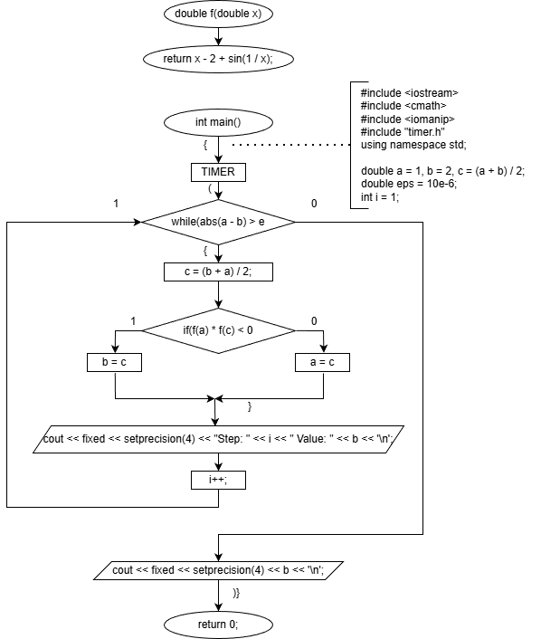
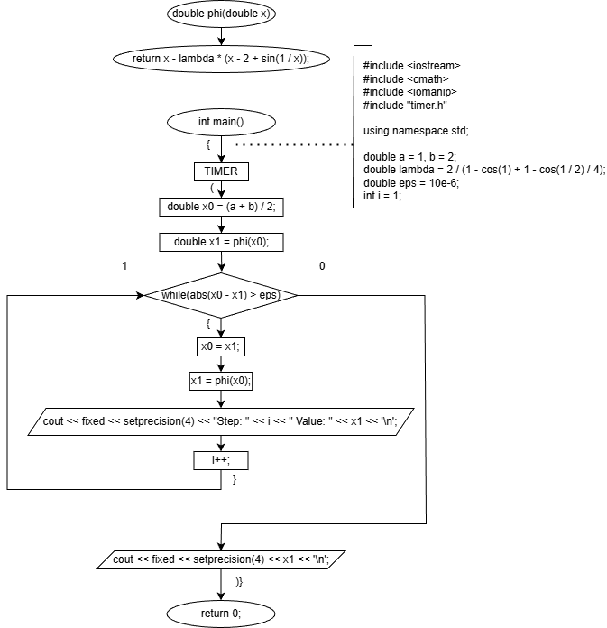
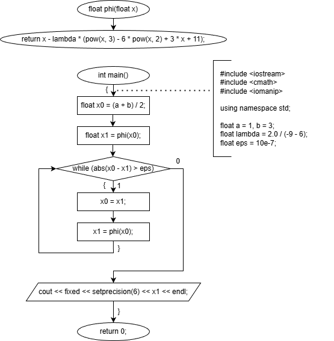
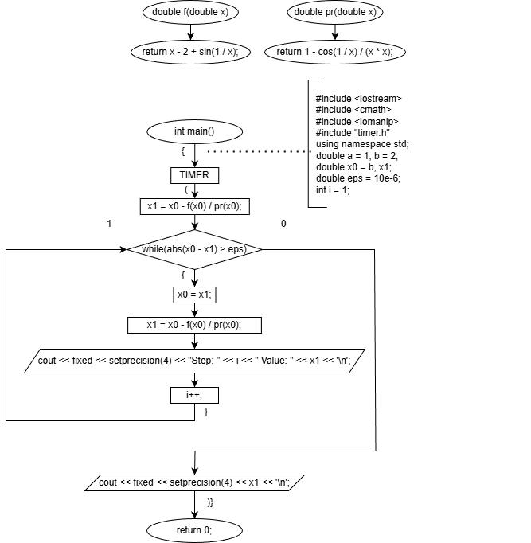
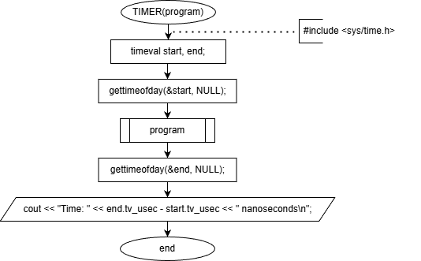

# sem1 / lab7

## Постановка задачи
Решить нелинейное уравнение трансцендентного вида методами Ньютона, половинного деления и итерационным методом. Подсчитать время исполнения каждого метода.
Данное уравнение:
Отрезок, содержащий корень: [1; 2].
Эталонное решение: 1,3077.

## Анализ задачи
### МЕТОД ПОДСЧЕТА ВРЕМЕНИ ИСПОЛНЕНИЯ

Для удобства подсчета времени исполнения каждого метода был создан макрос #define TIMER(program) в файле timer.h. Его логика сводится ко взятию системного времени перед выполнением основного алгоритма и после. Затем высчитывается разность этих двух значений и выводится время в наносекундах. Алгоритм макроса можно представить в виде блок-схемы:
Код макроса:
#include <sys/time.h>
#define TIMER(program) \
timeval start, end; \
gettimeofday(&start, NULL); \
program \
gettimeofday(&end, NULL);\
cout << "Time: " << end.tv_usec - start.tv_usec << " nanoseconds\n";
Помимо подсчета времени, в алгоритмах реализован вывод промежуточных результатов на каждой итерации цикла, что позволяет подсчитать общее число итераций.
### АНАЛИЗ РЕШЕНИЯ ПОЛОВИННЫМ ДЕЛЕНИЕМ

1. Начальная точка x0 выбирается на середине [a; b] – (a + b) / 2.
2. Проверяем [a; x0] и [x0; b]:
2.
2. Проверяем значение функции в точках f(a) f(x0) и f(b): перемножаем f(a) * f(x0), выбираем интервал с отрицательным знаком.
2.
4. Переносим границы на новые значения (интервал с отрицательным значением).
2.
5. Новая точка x1 выбирается на середине нового отрезка.
2.
6. Имеем два соседних корня x0 и x1.
3. Итерационно находятся значения x2, x3 ... xk, на каждом шагу сравниваются два соседних |xi – xi + 1| с ε. То есть, разность между двумя соседними значениями корня будет меньше некоторого заданного ε. Точность вычислений – 10-6, и при |xi- xi+1| <= ε эти корни попадают практически в одну точку, следовательно за искомый корень можно брать любой из них (например, xi + 1).
### АНАЛИЗ РЕШЕНИЯ МЕТОДОМ ПРОСТЫХ ИТЕРАЦИЙ

Производится релаксация:
Находятся значения производной от данной функции в точках a, b:
Находятся экстремумы первой производной.
Вторая производная принимает нулевые значения вне заданного диапазона поиска. Таким образом, минимальное и максимальное значение производной достигается в точках a, b.
По формуле
Где m и M – минимальное и максимальное значение производной на отрезке соответственно, находим множитель релаксации.
Итоговое уравнение для φ(x) будет выглядеть следующим образом:
Для более быстрой сходимости выберем приближение x0 = (a + b) / 2.
Каждое последующее приближение высчитывается по формулеxi + 1 = φ(xi)
Итерационно находятся значения x2, x3 ... xk, на каждом шагу сравниваются два соседних |xi – xi + 1| с ε. То есть, разность между двумя соседними значениями корня будет меньше некоторого заданного ε. Точность вычислений – 10-6, и при |xi- xi+1| <= ε эти корни попадают практически в одну точку, следовательно за искомый корень можно брать любой из них (например, xi + 1).
### АНАЛИЗ РЕШЕНИЯ МЕТОДОМ НЬЮТОНА

Так как f(b) * f ''(b) > 0, то начальное приближение выбирается справа: x0 = b.
Каждое последующее приближение вычисляется по формуле
Итерационно находятся значения x2, x3 ... xk, на каждом шагу сравниваются два соседних |xi – xi + 1| с ε. То есть, разность между двумя соседними значениями корня будет меньше некоторого заданного ε. Точность вычислений – 10-6, и при |xi- xi+1| <= ε эти корни попадают практически в одну точку, следовательно за искомый корень можно брать любой из них (например, xi + 1).

## Результаты
Step: 1 Value: 1.5000
Step: 2 Value: 1.5000
Step: 3 Value: 1.3750
Step: 4 Value: 1.3125
Step: 5 Value: 1.3125
Step: 6 Value: 1.3125
Step: 7 Value: 1.3125
Step: 8 Value: 1.3086
Step: 9 Value: 1.3086
Step: 10 Value: 1.3086
Step: 11 Value: 1.3081
Step: 12 Value: 1.3079
Step: 13 Value: 1.3077
Step: 14 Value: 1.3077
Step: 15 Value: 1.3077
Step: 16 Value: 1.3077
Step: 17 Value: 1.3077
1.3077
Time: 15554 nanoseconds
Исходя из выходных данных можно сделать вывод, что метод бисекции выполняется в течении 17 итераций и занимает время, приближенное к 15 миллисекундам.
Step: 1 Value: 1.3075
Step: 2 Value: 1.3077
Step: 3 Value: 1.3077
1.3077
Time: 3717 nanoseconds
Исходя из выходных данных можно сделать вывод, что итерационный метод выполняется в течении 3 итераций и занимает время, приближенное к 4 миллисекундам.
Step: 1 Value: 1.3096
Step: 2 Value: 1.3077
Step: 3 Value: 1.3077
1.3077
Time: 2969 nanoseconds
Исходя из выходных данных можно сделать вывод, что метод Ньютона выполняется в течении 3 итераций и занимает время, приближенное к 3 миллисекундам.

## Код
- [bisection.cpp](bisection.cpp)
- [iteration_method.cpp](iteration_method.cpp)
- [newton.cpp](newton.cpp)
- [timer.h](timer.h)

## Иллюстрации
- Схема метода половинного деления: 
- Схема итерационного метода: 
- Диаграмма: Itermethod Lecture: 
- Схема метода Ньютона: 
- Схема метода Ньютона: 
- Схема макроса TIMER: 
