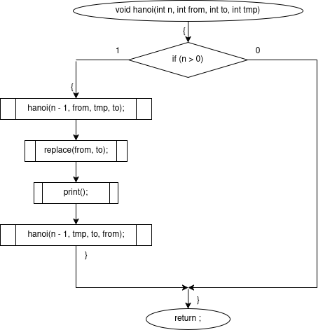
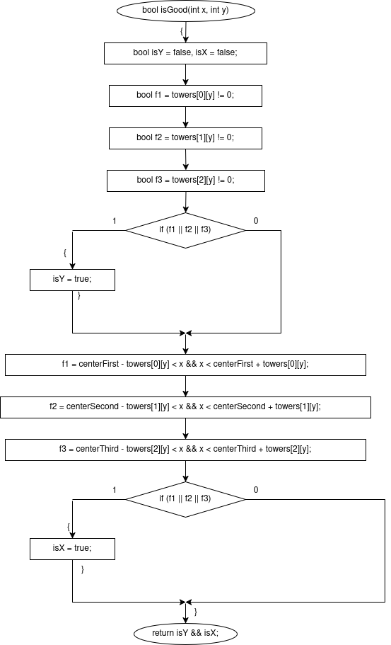
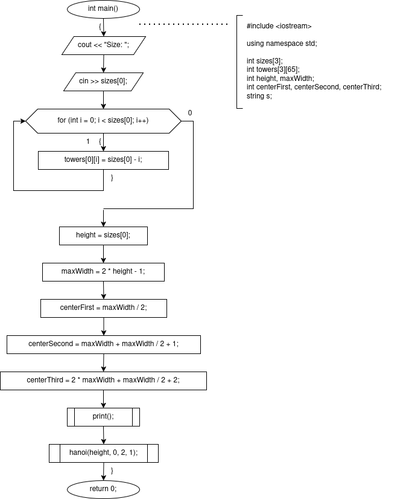
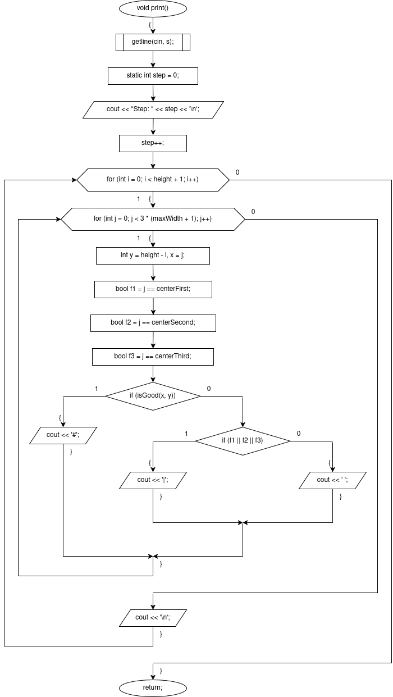
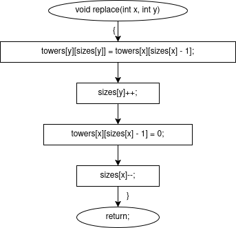

# sem2 / homeworks_1 / hanoi

## Код
- [2026.02.23_hanoi.cpp](2026.02.23_hanoi.cpp)

## Иллюстрации
- Диаграмма: 2026.02.23 Hanoi Hanoi: 
- Диаграмма: 2026.02.23 Hanoi Is Good: 
- Диаграмма: 2026.02.23 Hanoi Main: 
- Диаграмма: 2026.02.23 Hanoi Print: 
- Диаграмма: 2026.02.23 Hanoi Replace: 
