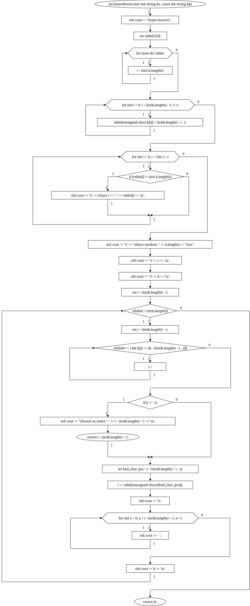
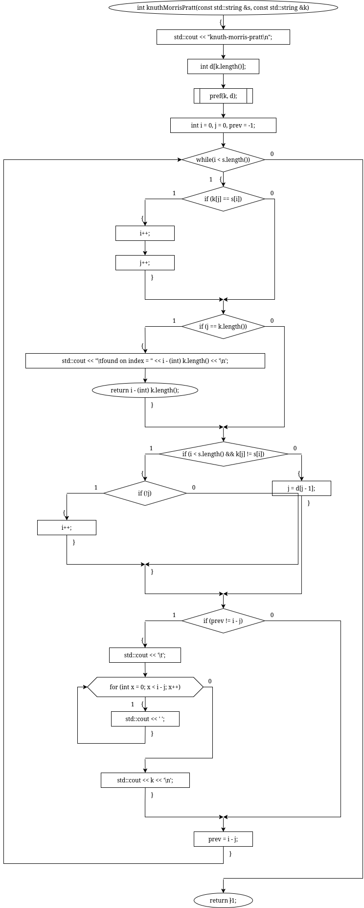
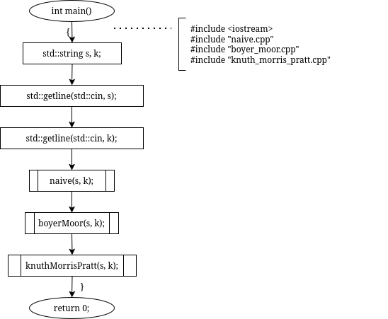
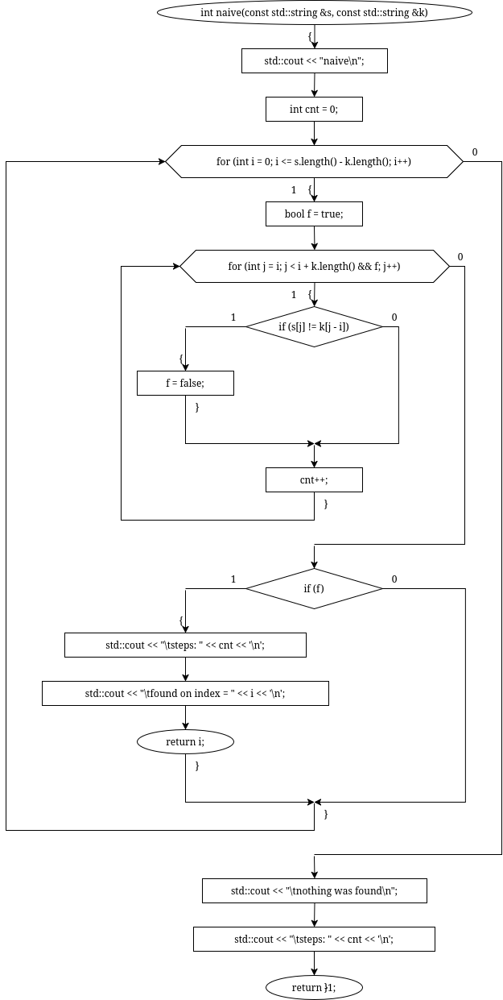
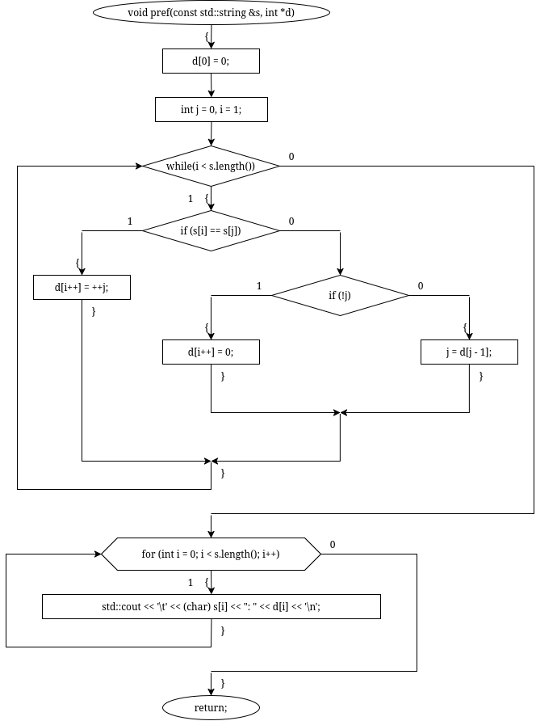

# sem2 / homeworks_2 / difficult_searches

## Постановка задачи
Реализовать алгоритмы поиска:
1. Наивный поиск подстроки в строке.
2. Поиск Боера-Мура.
3. Поиск Кнута-Морриса-Пратта.

## Анализ задачи
### АНАЛИЗ АЛГОРИТМА НАИВНОГО ПОИСКА

1. Последовательно перебираем каждый элемент строки циклом, затем ещё одним циклом попарно сравниваем элементы строки, начиная с текущего, с элементами образа. При несовпадении увеличиваем головной итератор на единицу. Иначе — нашли искомую подстроку.
### АНАЛИЗ АЛГОРИТМА БОЕРА-МУРА

1. Создаётся таблица смещений table[256]: для каждого символа записывается расстояние от его последнего появления в шаблоне до конца строки k. Для отсутствующих символов и последнего сдвиг равен длине шаблона.
2. Сравнение шаблона с текстом выполняется справа налево, начиная с последнего символа k. При несовпадении шаблон сдвигается на значение table[s[позиция_несовпавшего_в_исходной_строке_символа]]. Таким образом пропускаются заведомо неподходящие позиции и уменьшает число сравнений.
### АНАЛИЗ АЛГОРИТМА КНУТА-МОРРИСА-ПРАТТА

1. Префикс строки — начало строки, суффикс — её конец. Префикс-функция d[i] хранит длину наибольшего собственного префикса подстроки s[0..i], совпадающего с её суффиксом.
2 Для шаблона k предварительно вычисляется массив d, позволяющий определить, на сколько символов можно сдвинуть шаблон при несовпадении.
3. Сравнение текста и шаблона выполняется слева направо с помощью индексов i и j.
4. При несовпадении символов индекс j изменяется на d[j - 1], то есть поиск продолжается с позиции предыдущего возможного совпадающего префикса без повторной проверки символов текста.

## Результаты
ABC ABCDAB ABCDABCDABDEABCDABDnaivesteps: 39found on index = 15boyer-moorA: 2B: 1C: 4D: 3others symbols: 7ABC ABCDAB ABCDABCDABDEABCDABD    ABCDABD           ABCDABD               ABCDABDfound on index = 15knuth-morris-prattA: 0B: 0C: 0D: 0A: 1B: 2D: 0ABCDABD   ABCDABD    ABCDABD        ABCDABD          ABCDABD           ABCDABD               ABCDABDfound on index = 15

## Код
- [boyer_moor.cpp](boyer_moor.cpp)
- [knuth_morris_pratt.cpp](knuth_morris_pratt.cpp)
- [main.cpp](main.cpp)
- [naive.cpp](naive.cpp)

## Иллюстрации
- Диаграмма: Boyer Moor: 
- Диаграмма: Knuth Morris Pratt: 
- Общая схема программы: 
- Диаграмма: Naive: 
- Диаграмма: Pref: 
