# sem2 / homeworks_2 / external_sorts

## Постановка задачи
Реализовать алгоритмы внешних сортировок:
1. Метод естественного слияния.
2. Сбалансированное двухфазное слияние.
3. Многофазная сортировка.

## Анализ задачи
### АНАЛИЗ МЕТОДА ЕСТЕСТВЕННОГО СЛИЯНИЯ

1. Идём по файлу и делим на подряд идущие неубывающие куски.  2. Распределяем серии: по очереди записываем серии в два буфера, разделяя их маркером \.  3. Сливаем серии попарно: берём по одной серии из каждого буфера и сливаем, как в обычном merge, пока не упрёмся в \.  4. Повторяем: снова ищем серии уже в “рабочем” файле и сливаем, пока не останется одна серия.
### АНАЛИЗ МЕТОДА ДВУХФАЗНОГО СЛИЯНИЯ

1. В отличии от первого метода, не ищем естественные куски, а режем файл на серии длины 1, потом 2, 4, 8 и так далее.
2. Далее разделяем по сериям. Первые runLen элементов — в первый буфер, следующие runLen — во второй, и так далее. 3. Берём две серии одинаковой длины и сливаем их в основной файл. 4. Удваиваем длину: runLen *= 2 и повторяем, пока весь файл не станет одной серией.
### АНАЛИЗ МЕТОДА МНОГОФАЗНОГО ДЕЛЕНИЯ

1. Считаем число естественных серий во входе. 2. Подбираем два числа Фибоначчи таких, что их сумма покрывает число серий. Недостающее добиваем фиктивными сериями (\). 3. Начальное распределение осуществляем следующим образом: первые F(k) серий — в один файл, F(k-1) — в другой. Третий файл пустой. 4. Сливаем серии из двух входных в пустой, пока один входной не исчерпается. 5. Далее пустой файл становится входным, один из входных — пустым. Счётчики серий обновляются по Фибоначчи. 6. Повторяем, пока не останется одна серия — это и есть отсортированный файл.

## Результаты
75 49 4 36 20 19 89 79 8 96 57 64 58 28 76 98 12 42 17 96
natural
4 8 12 17 19 20 28 36 42 49 57 58 64 75 76 79 89 96 96 98
balanced
4 8 12 17 19 20 28 36 42 49 57 58 64 75 76 79 89 96 96 98
polyphase
4 8 12 17 19 20 28 36 42 49 57 58 64 75 76 79 89 96 96 98

## Код
- [balanced_merge_sort.cpp](balanced_merge_sort.cpp)
- [main.cpp](main.cpp)
- [natural_merge_sort.cpp](natural_merge_sort.cpp)
- [polyphase_merge_sort.cpp](polyphase_merge_sort.cpp)

## Файлы
- [in](in)

## Иллюстрации
- Диаграмма: Balanced Merge: 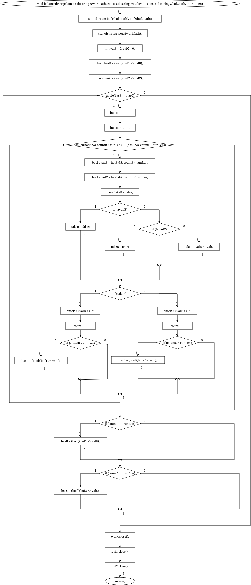
- Диаграмма: Balanced Sort: 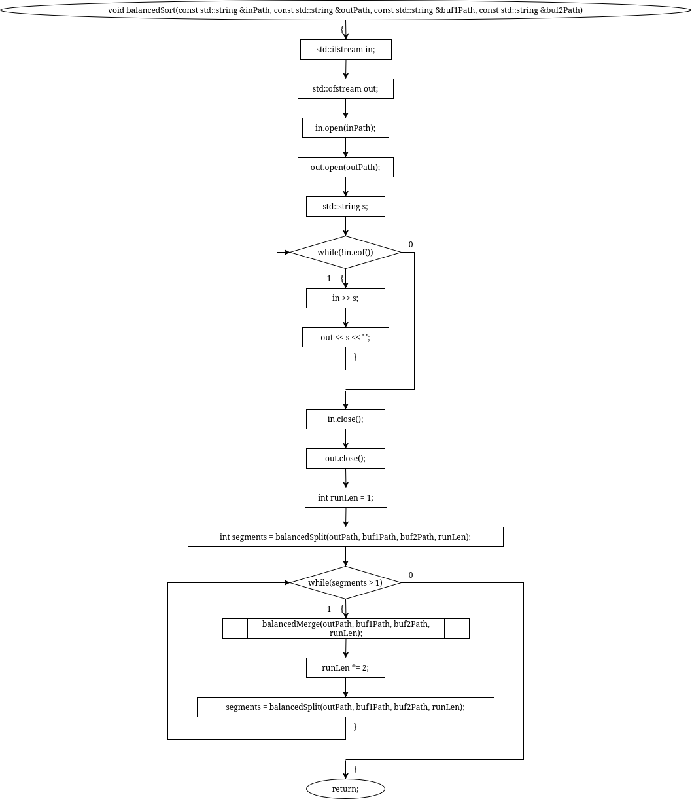
- Диаграмма: Balanced Split: 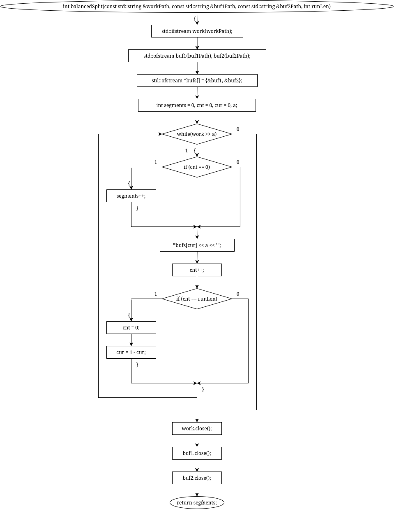
- Диаграмма: Count Series: 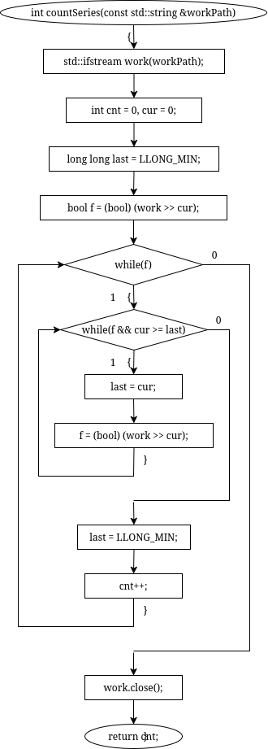
- Общая схема программы: 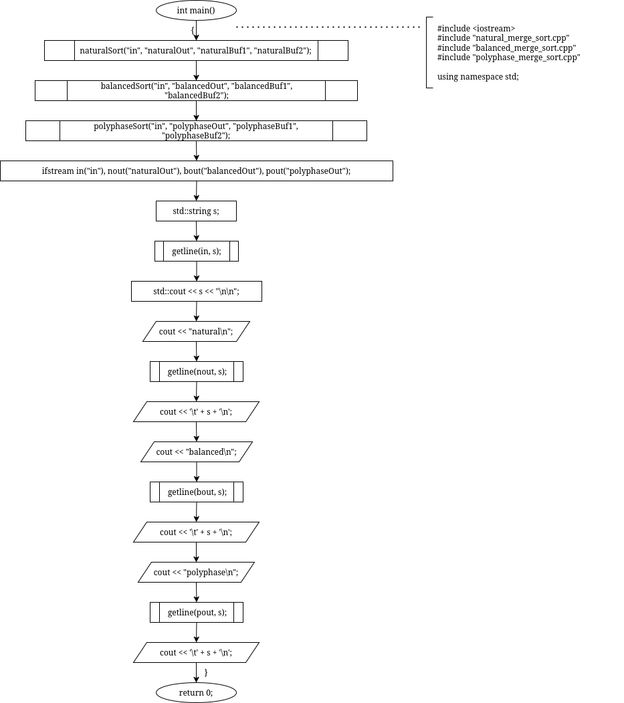
- Диаграмма: Natural Get Series: 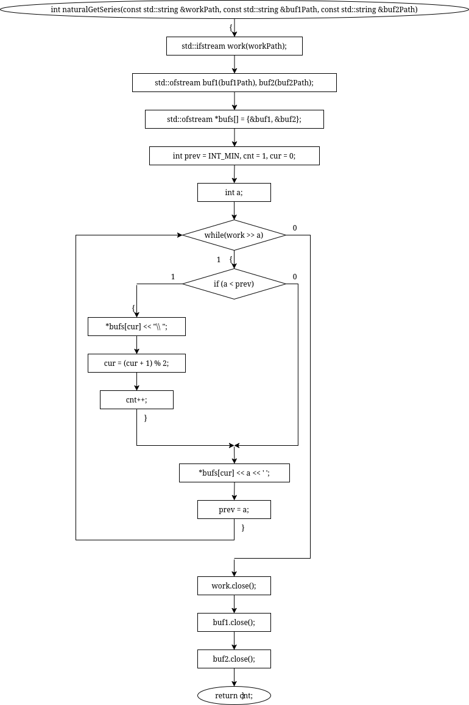
- Диаграмма: Natural Merge: 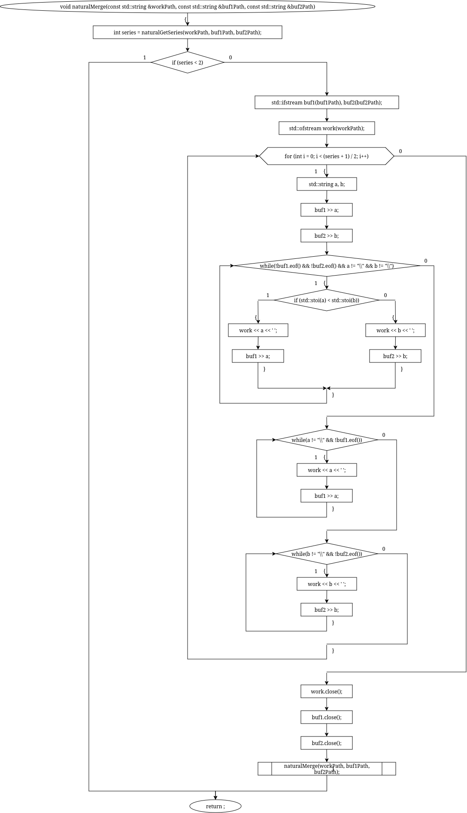
- Диаграмма: Natural Sort: 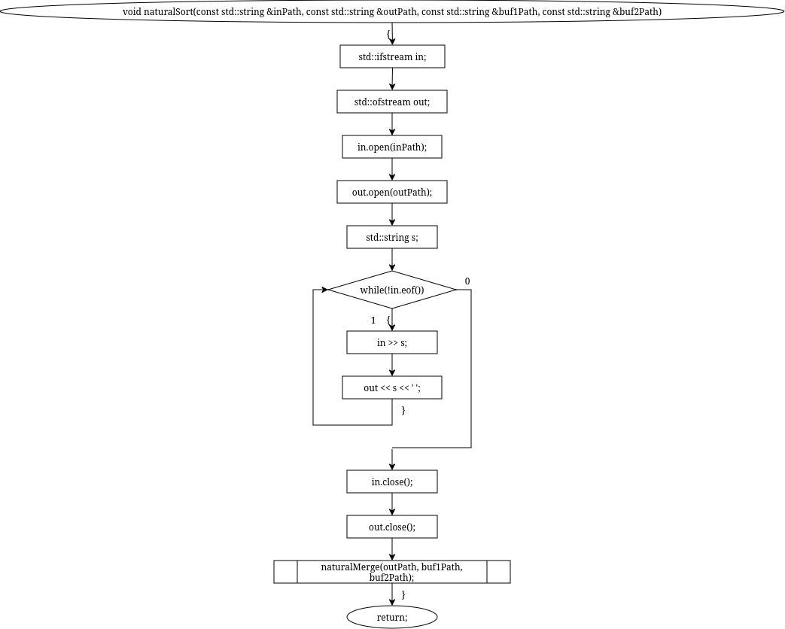
- Диаграмма: Polyphase Merge: 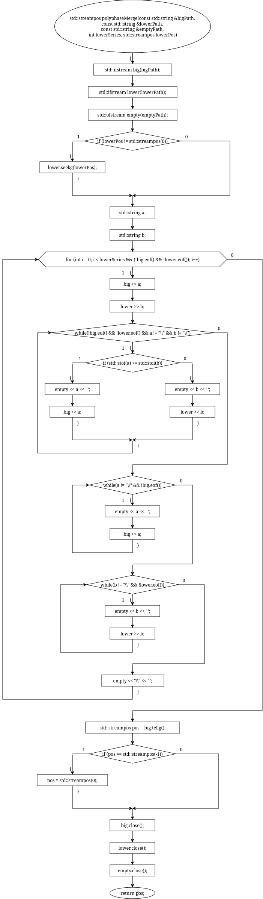
- Диаграмма: Polyphase Sort: 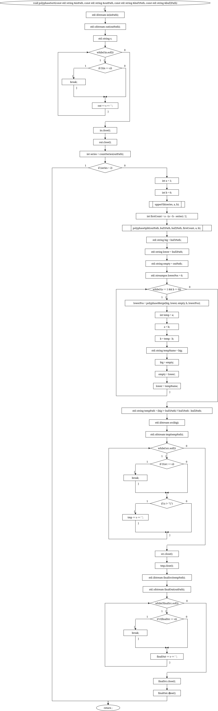
- Диаграмма: Polyphase Split: 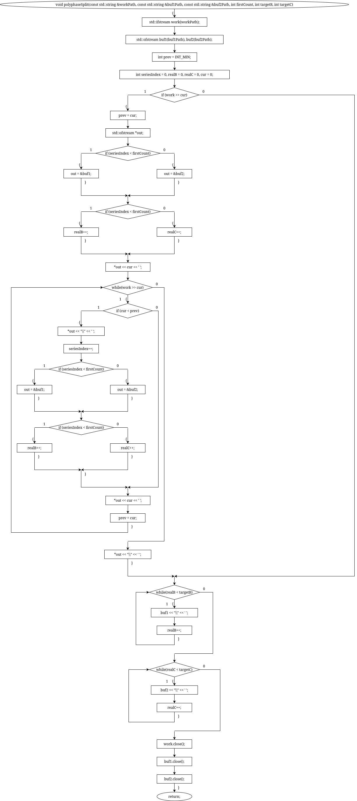
- Диаграмма: Upper Fib: 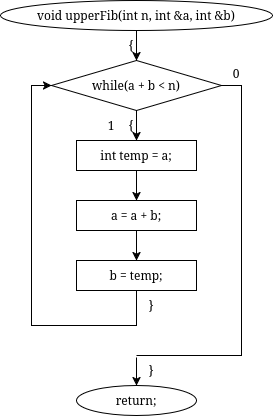
