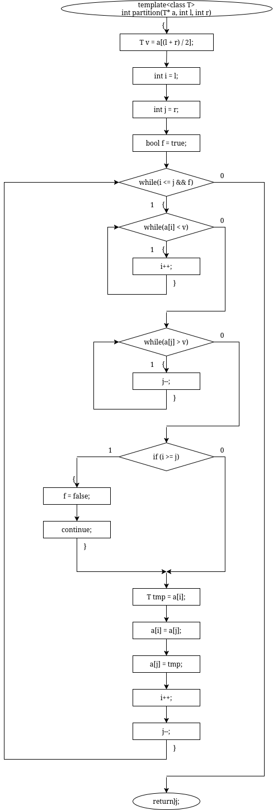
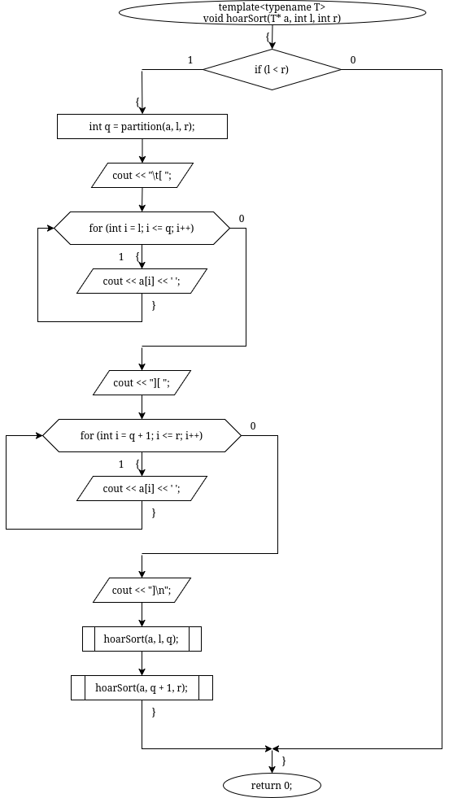
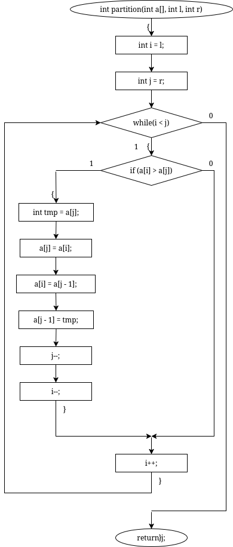
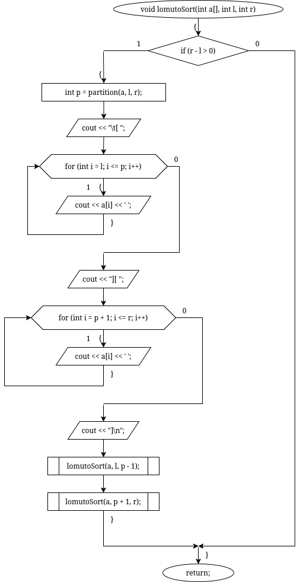
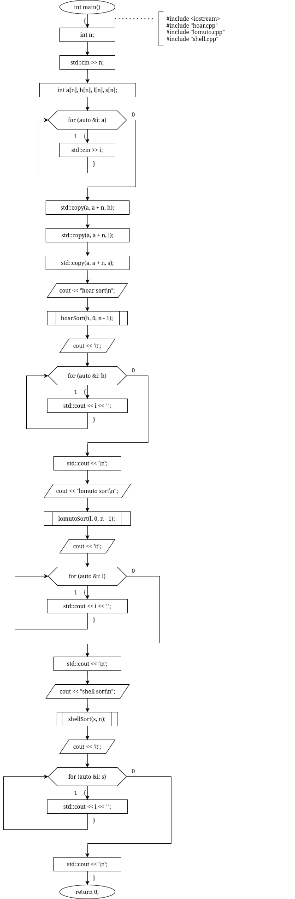
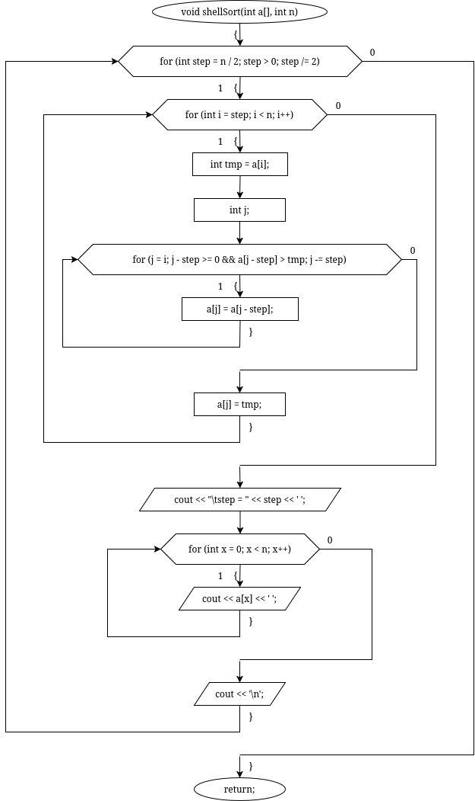

# sem2 / homeworks_2 / quick_sorts

## Постановка задачи
Реализовать алгоритмы сортировок:
1. Сортировка Хоара.
2. Сортировка Ломуто.
3. Сортировка Шелла.

## Анализ задачи
### АНАЛИЗ АЛГОРИТМОВ ХОАРА И ЛОМУТО

1. Выбирается опорный элемент – pivot
2. Все элементы меньше опорного располагаем слева от него, все что больше справа Шаг
3. Рекурсивно повторяем эти действия, пока не получим отсортированный массив.
4. Отличие этих двух алгоритмов состоит только в выборе опорного элемента и способа размещения элементов относительно него.
### АНАЛИЗ АЛГОРИТМА ШЕЛЛА

1. Вычисляется расстояние между элементами – step. Изначально n / 2
2. Массив разбивается на списки элементов, отстающих друг от друга на step
3. Элементы каждого списка сортируются методом вставки
4. Происходит объединение списков обратно в массив, step уменьшается в 2 раза, если step > 0, то происходит переход обратно на шаг 2.

## Результаты
7
15 10 8 3 0 -2 -5
hoar sort
[ -5 -2 0 3 ][ 8 10 15 ]
[ -5 -2 ][ 0 3 ]
[ -5 ][ -2 ]
[ 0 ][ 3 ]
[ 8 10 ][ 15 ]
[ 8 ][ 10 ]
-5 -2 0 3 8 10 15
lomuto sort
[ -5 ][ 10 8 3 0 -2 15 ]
[ 10 8 3 0 -2 15 ][ ]
[ -2 ][ 8 3 0 10 ]
[ 8 3 0 10 ][ ]
[ 0 ][ 3 8 ]
[ 3 8 ][ ]
-5 -2 0 3 8 10 15
shell sort
step = 3 -5 0 -2 3 10 8 15
step = 1 -5 -2 0 3 8 10 15
-5 -2 0 3 8 10 15

## Код
- [.lomuto.cpp](.lomuto.cpp)
- [hoar.cpp](hoar.cpp)
- [lomuto.cpp](lomuto.cpp)
- [main.cpp](main.cpp)
- [shell.cpp](shell.cpp)

## Иллюстрации
- Диаграмма: Hoar Partition: 
- Диаграмма: Hoar Sort: 
- Диаграмма: Lomuto Partition: 
- Диаграмма: Lomuto Sort: 
- Общая схема программы: 
- Диаграмма: Shell: 
