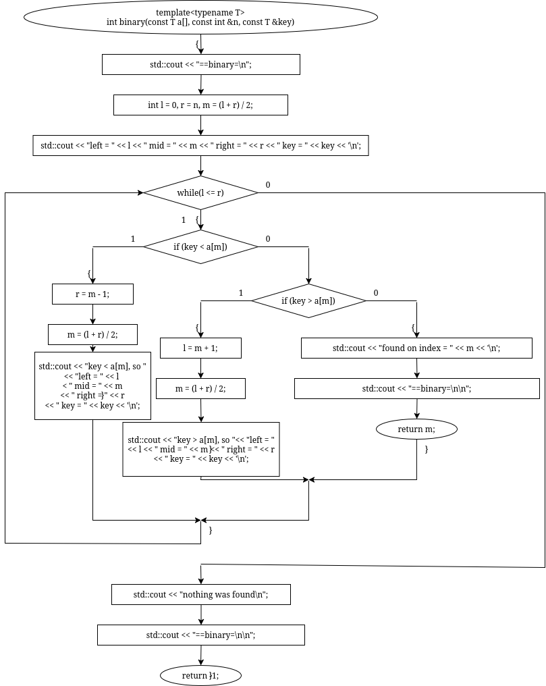
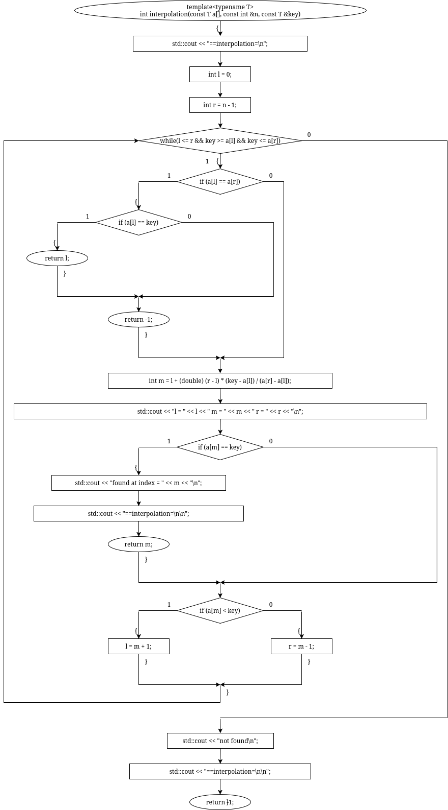
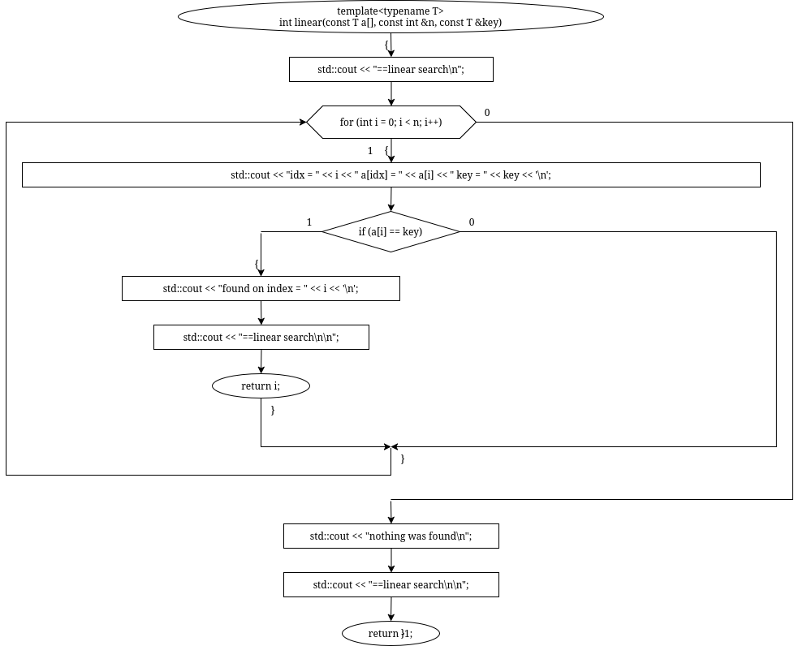
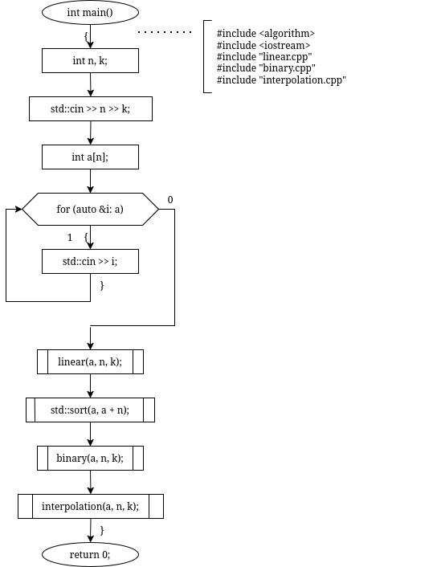

# sem2 / homeworks_2 / simple_searches

## Постановка задачи
Реализовать алгоритмы поиска:
1. Линейный поиск.
2. Бинарный поиск.
3. Интерполяционный поиск.

## Анализ задачи
### АНАЛИЗ АЛГОРИТМА ЛИНЕЙНОГО ПОИСКА

1. Последовательно перебираем каждый элемент массива циклом и сравниваем его с искомым. Когда нашлось совпадение — возвращаем текущий индекс.
### АНАЛИЗ АЛГОРИТМА БИНАРНОГО ПОИСКА

1. Находим границы множества и его середину.
2. Сравниваем ключ с серединным элементом:2.1 Если искомое значение элемента меньше серединного, то продолжается поиск в левой части множества2.2 Если искомое значение элемента больше серединного, то продолжается поиск в правой части множества
### АНАЛИЗ АЛГОРИТМА ИНТЕРПОЛЯЦИОННОГО ПОИСКА

1. Находим границы множества.
2. Вычисляем середину по формуле l + (r - l) * (key - a[l]) / (a[r] – a[l]).
2. Сравниваем ключ с серединным элементом:2.1 Если искомое значение элемента меньше серединного, то продолжается поиск в левой части множества2.2 Если искомое значение элемента больше серединного, то продолжается поиск в правой части множества

## Код
- [binary.cpp](binary.cpp)
- [interpolation.cpp](interpolation.cpp)
- [linear.cpp](linear.cpp)
- [main.cpp](main.cpp)

## Иллюстрации
- Схема бинарного поиска: 
- Схема интерполяционного поиска: 
- Схема линейного поиска: 
- Общая схема программы: 
