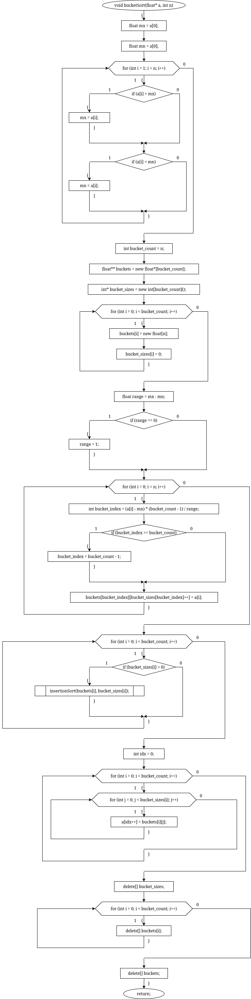
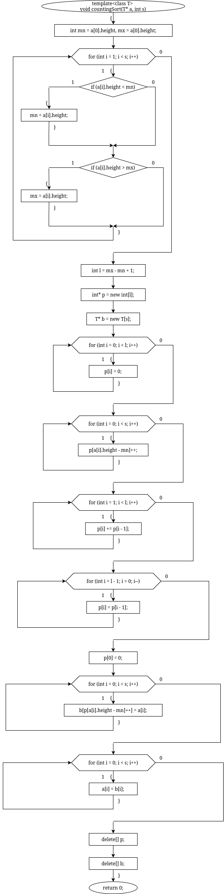
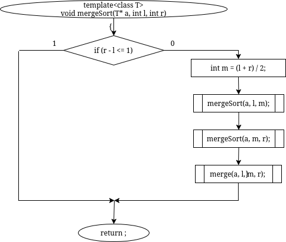
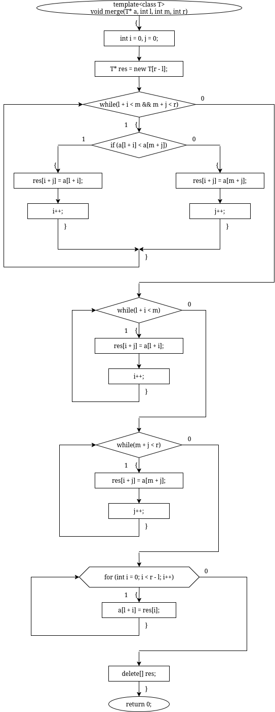
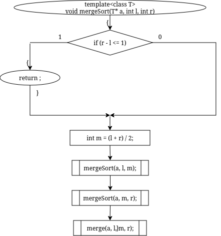

# sem2 / homeworks_2 / simple_sorts

## Постановка задачи
Реализовать алгоритмы сортировки:
1. Сортировка слиянием.
2. Сортировка подсчетом.
3. Блочная сортировка.

## Анализ задачи
### АНАЛИЗ АЛГОРИТМА СОРТИРОВКИ СЛИЯНИЕМ

Для работы алгоритма следует реализовать следующие операции:
• Операцию для рекурсивного разделения массива на группы (метод sort);
• Слияние в правильном порядке (метод merge);
• Недостатки метода заключаются в том, что требуется дополнительная память по объему,
равной объему сортируемого файла. Поэтому для больших файлов проблематично
организовать сортировку слиянием в оперативной памяти.
### АНАЛИЗ АЛГОРИТМА СОРТИРОВКИ ПОДСЧЕТОМ

• Идея алгоритма состоит в предварительном подсчете количества элементов с различными
ключами в исходном массиве и разделении результирующего массива на части
соответствующей длины (блоки). Затем при повторном проходе исходного массива каждый
его элемент копируется в специально отведенный его ключу блок, в первую свободную
ячейку.
• Таким образом после завершения алгоритма в результирующем массиве содержится
исходная последовательность в отсортированном виде, так как блоки расположены по
возрастанию соответствующих ключей
### АНАЛИЗ АЛГОРИТМА БЛОЧНОЙ СОРТИРОВКИ

Алгоритм блочной (корзинной) сортировки разделяет элементы массива входных данных на некоторое количество блоков - k, количество блоков зависит от количества исходного множества данных. Далее каждый из таких блоков сортируется либо другой сортировкой, либо рекурсивно тем же методом разбиения. После сортировок внутри каждых блоков данные записываются в исходный массив в порядке разбиения на блоки.

## Результаты
Bucket sort
До сортировки:
0.78 0.17 0.39 0.26 0.72 0.94
После сортировки:
0.17 0.26 0.39 0.72 0.78 0.94
Counting sort
До сортировки:
Алексей: 178cm
Мария: 165cm
Дмитрий: 182cm
Анна: 170cm
Иван: 165cm
Елена: 175cm
После сортировки:
Мария: 165cm
Иван: 165cm
Анна: 170cm
Елена: 175cm
Алексей: 178cm
Дмитрий: 182cm
Merge sort
До сортировки:
0.78 0.17 0.39 0.26 0.72 0.94
После сортировки:
0.17 0.26 0.39 0.72 0.78 0.94

## Код
- [bucket.cpp](bucket.cpp)
- [bucket_presentation.cpp](bucket_presentation.cpp)
- [counting.cpp](counting.cpp)
- [counting_nums.cpp](counting_nums.cpp)
- [main.cpp](main.cpp)
- [merge.cpp](merge.cpp)

## Иллюстрации
- Диаграмма: Bucket: 
- Диаграмма: Counting: 
- Диаграмма: Merge Merge Fix: 
- Диаграмма: Merge Merge: 
- Диаграмма: Merge Merge Sort: 
