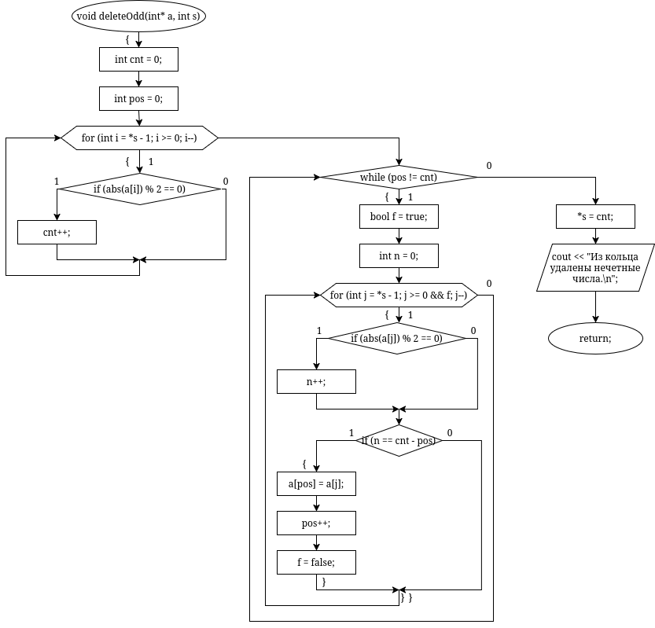
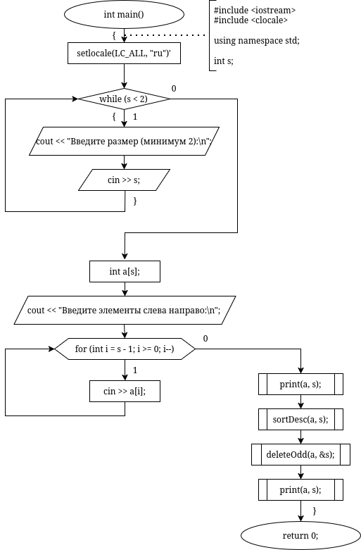
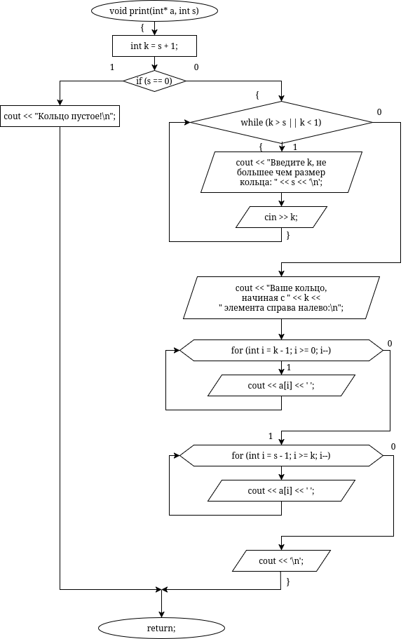
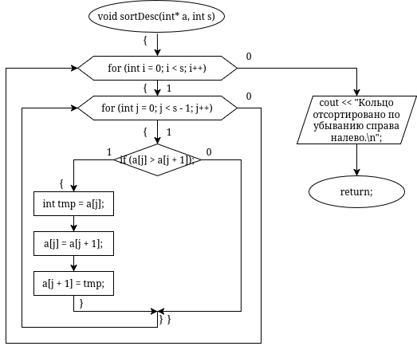

# sem2 / manual_1 / lab04

## Постановка задачи
1. Реализовать с использованием массива однонаправленное кольцо (просмотр возможен справа налево, от первого элемента можно перейти к последнему).
2. Распечатать полученный массив, начиная с К-ого элемента и до К+1.
3. Упорядочить элементы по убыванию
4. Удалить из кольца нечетные элементы.
5. Распечатать полученный массив, начиная с К-ого элемента
и до К+1.

## Результаты
Введите размер (минимум 2):
12
Введите элементы справа налево:
1 2 3 4 5 6 7 8 9 10 11 12
Введите k, не большее чем размер кольца: 12
6
Ваше кольцо, начиная с 6 элемента справа налево:
7 8 9 10 11 12 1 2 3 4 5 6
Кольцо отсортировано по убыванию справа налево.
Из кольца удалены нечетные числа.
Введите k, не большее чем размер кольца: 6
6
Ваше кольцо, начиная с 6 элемента справа налево:
12 10 8 6 4 2

## Код
- [main.cpp](main.cpp)

## Иллюстрации
- Диаграмма: Lab4 Delete Odd: 
- Диаграмма: Lab4 Main: 
- Диаграмма: Lab4 Print: 
- Диаграмма: Lab4 Sort Desc: 
