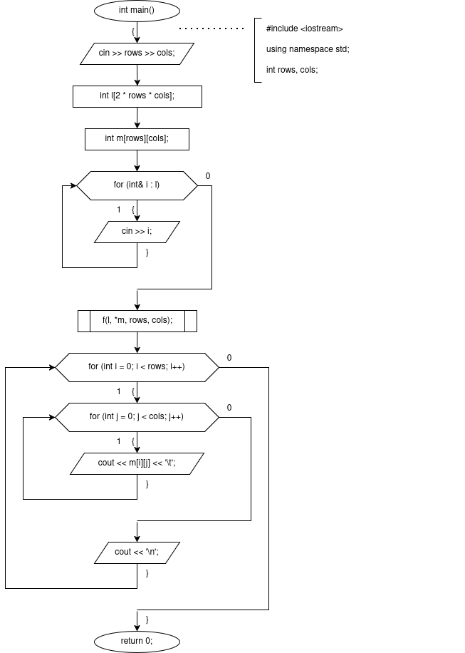

# sem2 / manual_1 / lab05

## Постановка задачи
Используя функции, решить указанную в варианте задачу. Массив должен передаваться в функцию как параметр.
Из двумерного массива в одномерный записали сначала строки в произвольном порядке, затем столбцы в произвольном порядке. Написать программу восстанавливающую исходный двумерный массив по одномерному, если известна размерность двумерного массива и элементы в нем не повторяются.

## Анализ задачи
### АНАЛИЗ.

1. Так как функция работает с массивами, в неё следует передать int* l — указатель на исходный массив, int* m — указатель на первый элемент матрицы. Зная, что в двумерном массиве строки в памяти лежат последовательно, пользуясь смещениями, мы сможем работать с элементами матрицы. Передадим также int rows, int cols — размеры матрицы.
2. Так как числа исходного массива не повторяются, то искомый задается однозначно.
3. В головном цикле перебираем все элементы первой половины, в которой записаны строки (итератор i).
4. В первом подцикле ищем позицию, на которой i-й элемент повторяется (итератор j).
5. Когда повтор найден, вычисляем pos = (j - rows*cols) % rows — номер строки этого куска в итоговой матрице. Это работает потому, что вторая половина l хранит столбцы по rows элементов каждый. Позиция элемента внутри своего столбца (% rows) — это и есть его строковый индекс в матрице.
6. Зная номер строки, копируем cols элементов текущего куска из первой половины в строку pos матрицы, пользуясь смещением pos * cols.
7. В функции main введем количества столбцов и строк, объявим массивы и введем элементы исходного массива. Затем вызовим функцию, после чего распечатаем результат при помощи двойного цикла for.

## Результаты
3 4
5 6 7 8 1 2 3 4 9 10 11 12 2 6 10 1 5 9 3 7 11 4 8 12
1234
5678
9101112

## Код
- [main.cpp](main.cpp)

## Иллюстрации
- Общая схема программы: 
- Общая схема программы: 
