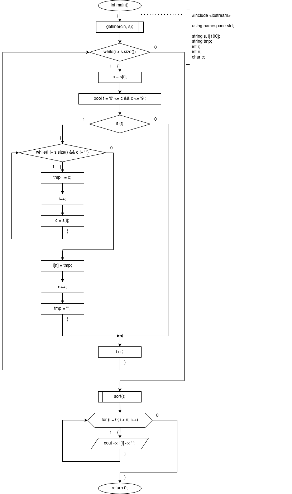
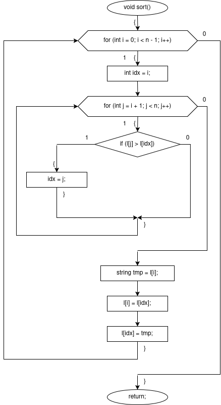

# sem2 / manual_1 / lab06

## Постановка задачи
Все слова строки, которые начинаются с цифры отсортировать по убыванию

## Анализ задачи
### АНАЛИЗ.

1. Вводится одна строка. Используем для этого getline(cin, s).
2. В цикле while с итератором i идем до конца строки — s.size(), присваиваем переменной char c значение s[i].
3. При помощи флага проверяем, является ли введеный символ числом.
4. Если является — вторым циклом while идем до конца слова, то есть пока не встретим пробел, или конец строки. Собираем из этих символов строку tmp.
5. Как только строка собрана, добавляем её в массив l.
6. После главного цикла используем сортировку выбором, применяя лексикографическое сравнение.
7. Выводим массив.

## Результаты
1aa 2bb ccc 5ddd 4eee fff ggg 7hhh
7hhh 5ddd 4eee 2bb 1aa

## Код
- [main.cpp](main.cpp)

## Иллюстрации
- Общая схема программы: 
- Общая схема программы: 
