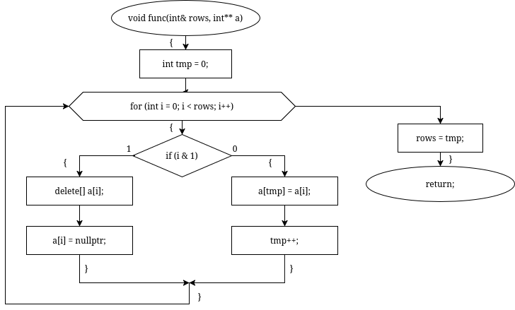
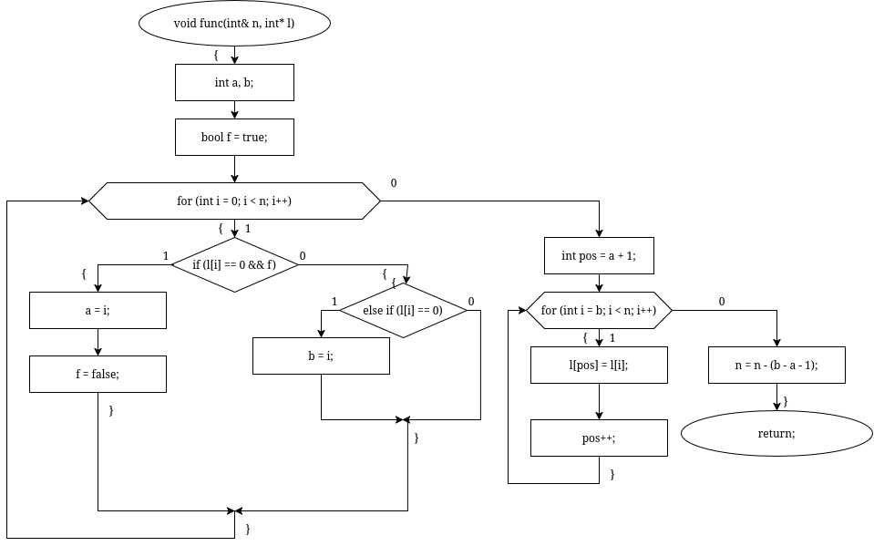
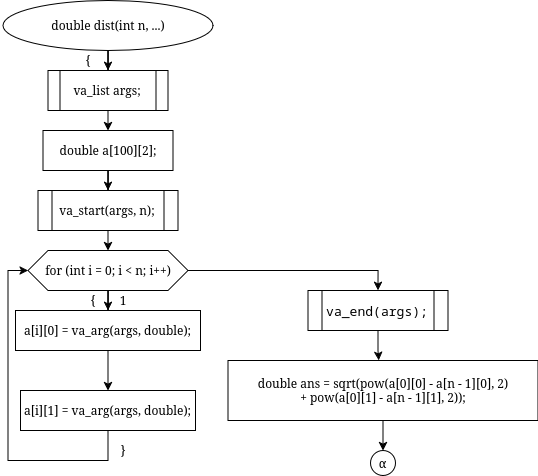
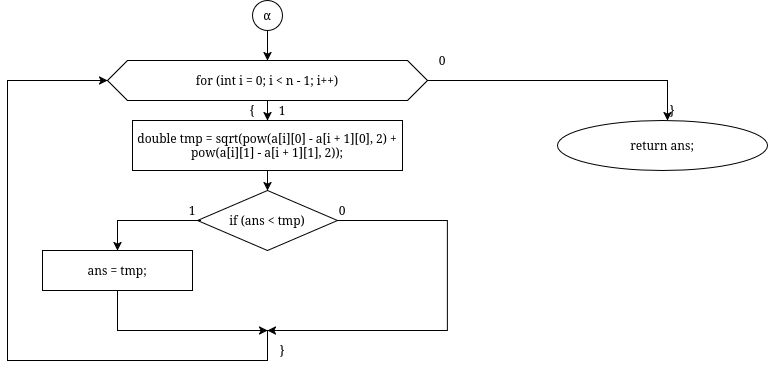
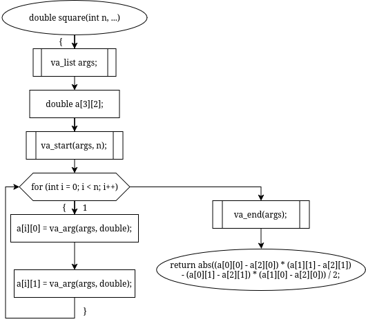
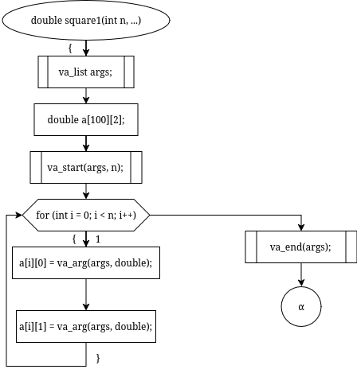
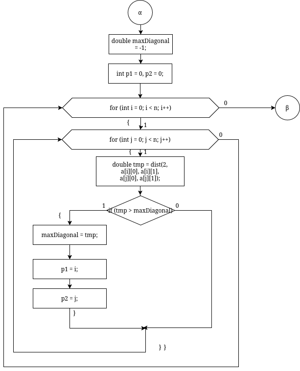
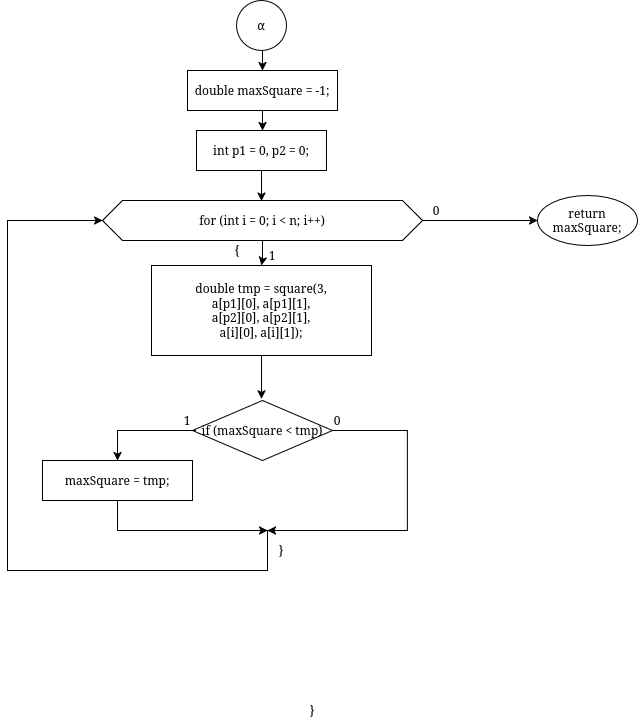

# sem2 / manual_1 / lab07

## Код
- [7.1.cpp](7.1.cpp)
- [7.2.cpp](7.2.cpp)
- [test.cpp](test.cpp)

## Иллюстрации
- Диаграмма: 7.1 A: 
- Диаграмма: 7.1 B: 
- Диаграмма: 7.2 A 1: 
- Диаграмма: 7.2 A 2: 
- Диаграмма: 7.2 B: 
- Диаграмма: 7.2 С 1: 
- Диаграмма: 7.2 С 2: 
- Диаграмма: 7.2 С 3: 
