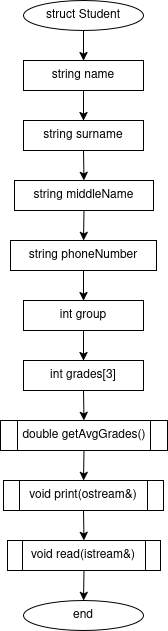
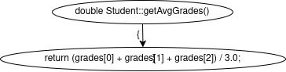
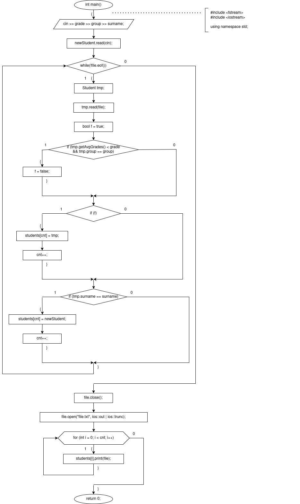
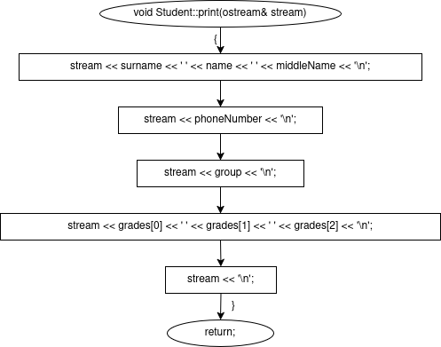
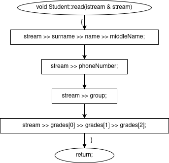

# sem2 / manual_1 / lab08

## Постановка задачи
Сформировать двоичный файл из элементов, заданной в варианте структуры, распечатать его содержимое, выполнить удаление и добавление элементов в соответствии со своим вариантом, используя для поиска удаляемых или добавляемых элементов функцию. Формирование, печать, добавление и удаление элементов оформить в виде функций. Предусмотреть сообщения об ошибках при открытии файла и выполнении операций ввода/вывода.
Структура "Студент":
- фамилия, имя, отчество;
- номер телефона;
- группа;
- оценки по 3 основным предметам.
Удалить все элементы из группы с указанным номером, у которых среднее арифметическое оценок меньше заданного, добавить элемент после элемента с заданной фамилией.

## Анализ задачи
### АНАЛИЗ.

1. Создадим структуру Student со всеми перечисленными в постановке задачи полями.
2. Для подсчета среднего балла используем метод double getAvgGrades().
3. Для вывода структуры в консоль или файл, используем метод double void print(ostream&), принимающий в качестве аргумента ссылку на поток вывода, которым может являться или cin, или файл, открытый с флагом ios::out. Метод будет последовательно выводить в поток все поля структуры.
4. Аналогично зададим метод void read(istream&) для чтения данных о студенте из консоли или файла.
5. Откроем файл с флагом ios::in для чтения. В int main() сначала введем минимальный средний балл, затем группу и фамилию студента, после которого нужно будет добавить нового. Затем при помощи Student::read(cin) введем нового студента.
6. Далее в цикле while(!file.eof()) считаем каждого записанного там студента. Если студент проходит по критериям минимального среднего балла и группы, то мы добавляем его в массив. Если студент несет фамилию, полученную в первом вводе, то после него нам следует добавить в массив нового студента.
7. Далее закроем файл и откроем его с флагами ios::out для чтения и ios::trunc для того, чтобы все хранящиеся там данные были удалены.
8. Циклом for пройдемся по всем студентам в массиве и при помощи метода Student::print(file) запишем информацию о каждом студенте в файл.

## Результаты
Файл до операций:
Pushkin Alexander Sergeyevich+7800555353515 5 5Tolstoy Lev Nikolayevich+7916123456725 5 5Dostoevsky Fyodor Mikhailovich+7903765432125 5 5Chekhov Anton Pavlovich+7925444332225 5 5Turgenev Ivan Sergeyevich+7910987654312 2 2Gogol Nikolai Vasilyevich+7938112233412 2 2
Ввод в консоль программы:
3 1 TolstoyBulgakov Mikhail Afanasyevich+7967554433225 5 5
Файл после операций:
Pushkin Alexander Sergeyevich+7800555353515 5 5Tolstoy Lev Nikolayevich+7916123456725 5 5Bulgakov Mikhail Afanasyevich+7967554433225 5 5Dostoevsky Fyodor Mikhailovich+7903765432125 5 5Chekhov Anton Pavlovich+7925444332225 5 5

## Код
- [main.cpp](main.cpp)

## Файлы
- [file.txt.example](file.txt.example)

## Дополнительные материалы
- [file.txt](file.txt)

## Иллюстрации
- Общая схема программы: 
- Общая схема программы: 
- Общая схема программы: 
- Общая схема программы: 
- Общая схема программы: 
