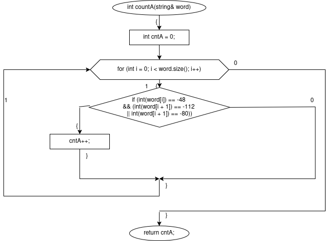
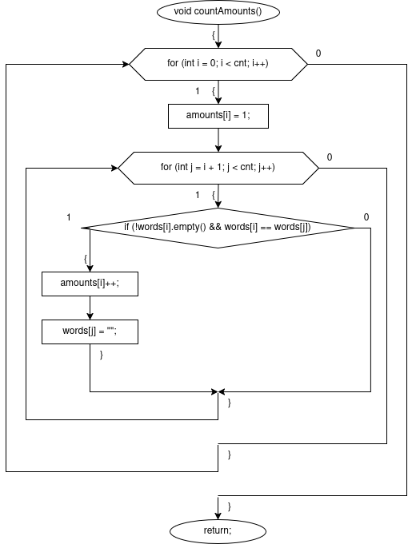
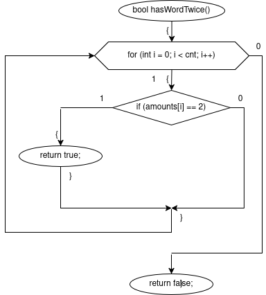
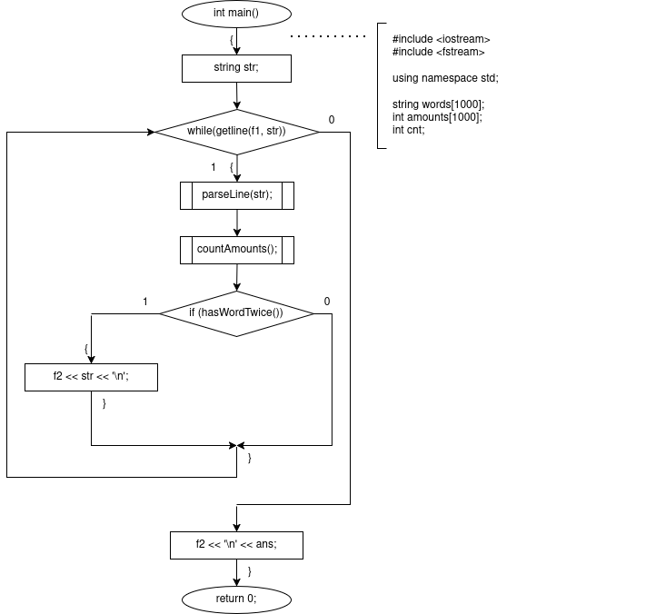
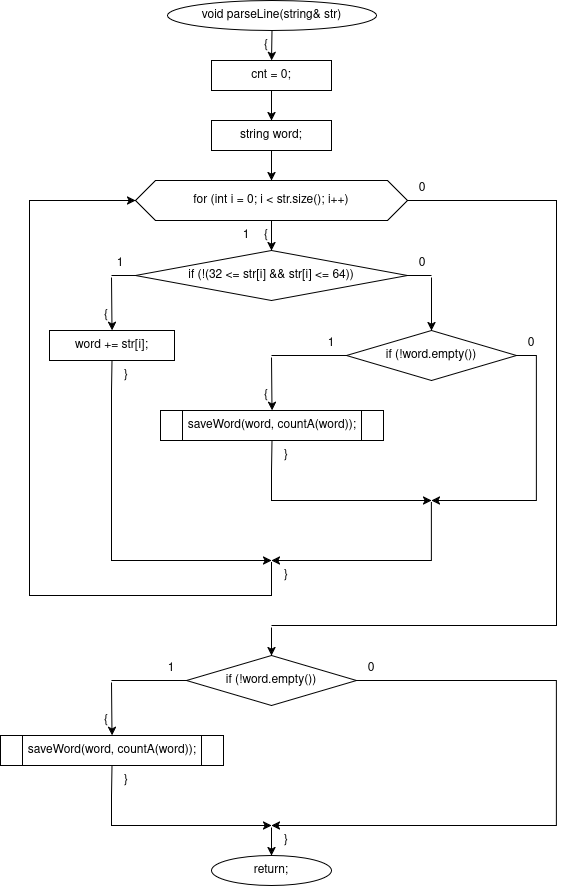
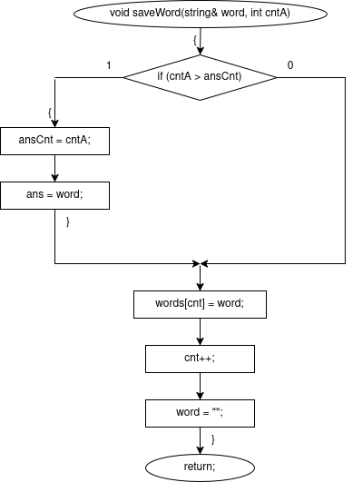

# sem2 / manual_1 / lab09

## Постановка задачи
1) Скопировать из файла F1 в файл F2 все строки, в которых содержится два одинаковых слова.
2) Определить номер слова, в котором больше всего букв «А».

## Анализ задачи
Объявляем глобальные переменные: ifstream f1("F1"), ofstream f2("F2") — файлы для чтения и записи, string ans — слово с наибольшим числом букв "А", int ansCnt = 0 — счётчик букв "А" в слове ans, string words[1000], int amounts[1000], int cnt — массивы слов и их вхождений для текущей строки, общие для всех функций.
В main заводим string str для считывания строк. В цикле while (getline(f1, str)) поочерёдно считываем строки из f1 и для каждой последовательно вызываем parseLine, countAmounts, hasWordTwice. После обработки всех строк дозаписываем в f2 через '\n' слово ans — слово с наибольшим числом кириллических букв "А" среди всех слов всех строк.
parseLine(str) разбивает текущую строку на слова. Обнуляем cnt. В цикле по символам строки (итератор i): если символ не входит в диапазон ASCII 32–64 — пробелы, знаки препинания, цифры — добавляем его в word; если символ является разделителем и word непустое — слово собрано, вызываем countA(word) для подсчёта букв "А" и передаём результат в saveWord. После цикла отдельно проверяем, не осталось ли непустое word — это последнее слово строки, которое не заканчивается разделителем, и также вызываем для него countA и saveWord.
countA(word) подсчитывает число букв "А" и "а" в переданном слове. Заметим, что: заглавная "А" кодируется парой байт (-48, -112), строчная "а" — парой (-48, -80). В цикле по байтам слова при обнаружении первого байта -48 проверяем следующий байт: если он равен -112 или -80 — увеличиваем счётчик cntA. Возвращаем итоговое значение cntA в parseLine.
saveWord(word, cntA) сохраняет готовое слово в глобальный массив. Сравниваем переданный cntA с глобальным ansCnt: если cntA > ansCnt — обновляем ansCnt = cntA и ans = word, запоминая новый максимум. Записываем word в words[cnt], увеличиваем cnt, обнуляем word для сбора следующего слова.
countAmounts() подсчитывает количество конкретного слова в текущей строке. В двойном цикле: для каждого words[i] устанавливаем amounts[i] = 1, затем внутренним циклом перебираем words[j]. Если words[j] непустое и совпадает с words[i] — увеличиваем amounts[i] и обнуляем words[j], чтобы не учитывать его повторно в дальнейших итерациях.
hasWordTwice() перебирает массив amounts от 0 до cnt и проверяет, есть ли слово, встречающееся ровно 2 раза. Если amounts[i] == 2 — возвращает true. Если таких слов не найдено — возвращает false. В main: если функция вернула true — записываем всю строку str в f2.

## Код
- [main.cpp](main.cpp)

## Файлы
- [F1](F1)

## Иллюстрации
- Общая схема программы: 
- Общая схема программы: 
- Общая схема программы: 
- Общая схема программы: 
- Общая схема программы: 
- Общая схема программы: 
