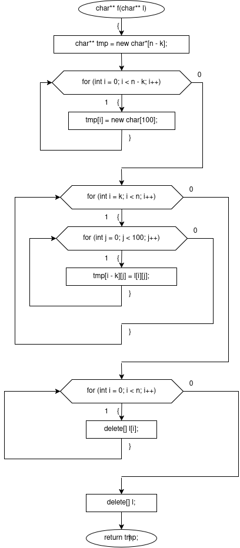
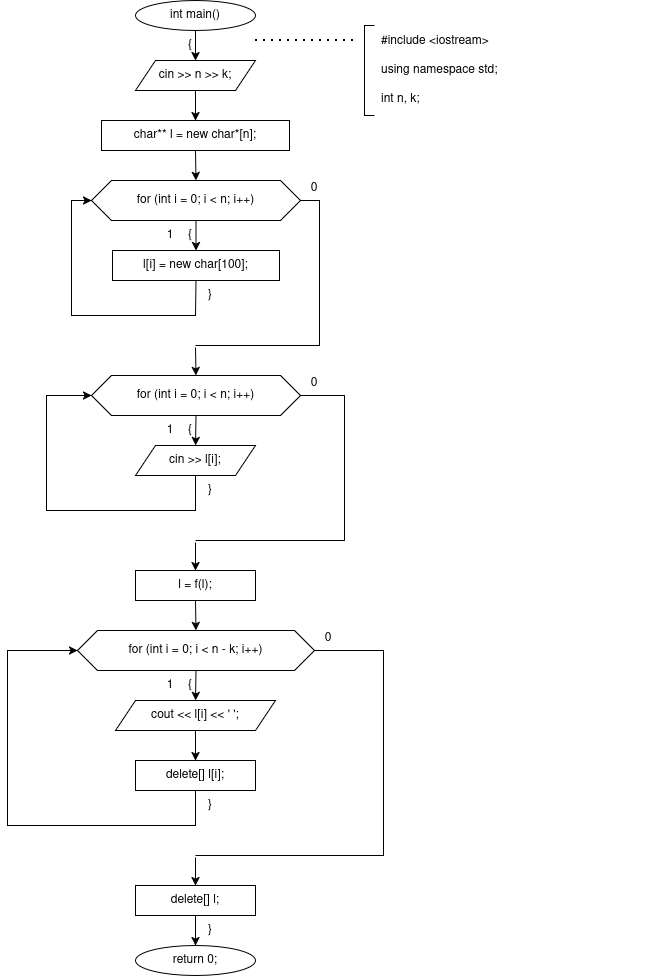

# sem2 / manual_1 / lab10

## Постановка задачи
Написать программу, в которой создаются динамические массивы и выполнить их обработку в соответствии со своим вариантом.
Сформировать массив строк. Удалить из него К первых строк.

## Анализ задачи
Объявляем глобальные переменные: int n — количество строк, int k — количество строк, которые нужно удалить с начала.
В main считываем n и k. Выделяем динамический массив указателей char** l размером n, каждый элемент — строка char[100]. Считываем n строк через cin >> l[i]. Затем вызываем f(l) и перезаписываем l результатом. После выводим оставшиеся n-k строк через пробел, освобождая каждую строку, затем освобождаем массив указателей.
Функция f(l) удаляет первые k строк из массива. Выделяем новый массив tmp размером n-k, каждый элемент — строка char[100]. В цикле от i=k до n копируем строки побайтово (по 100 байт) из l[i] в tmp[i-k] — таким образом первые k строк пропускаются. Затем освобождаем каждую строку исходного массива l[i] и сам массив l. Возвращаем tmp.

## Код
- [main.cpp](main.cpp)

## Иллюстрации
- Общая схема программы: 
- Общая схема программы: 
