# sem2 / manual_1 / lab11 / bidirectional

## Код
- [bidirectional.cpp](bidirectional.cpp)
- [bidirectional.h](bidirectional.h)

## Иллюстрации
- Двунаправленный список: Bi List: 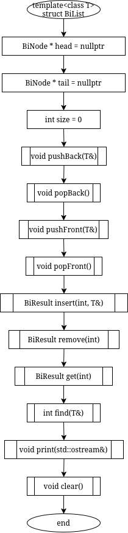
- Двунаправленный список: Bi Node: 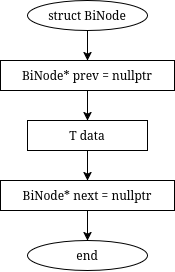
- Двунаправленный список: Bi Result: 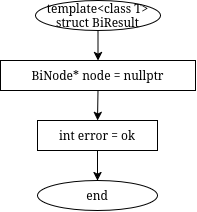
- Двунаправленный список: Clear: 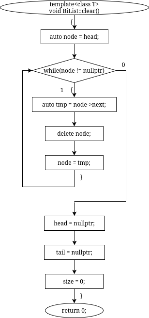
- Двунаправленный список: Find: 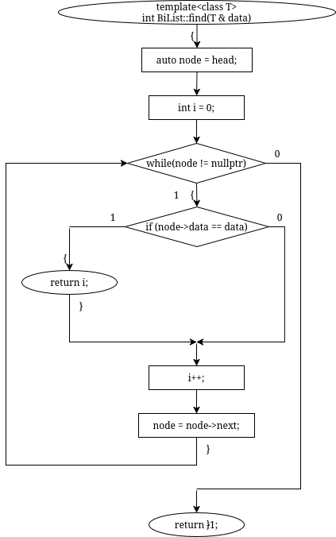
- Двунаправленный список: Get: 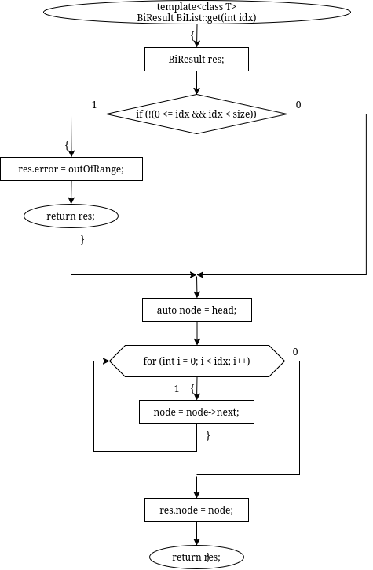
- Двунаправленный список: Insert: 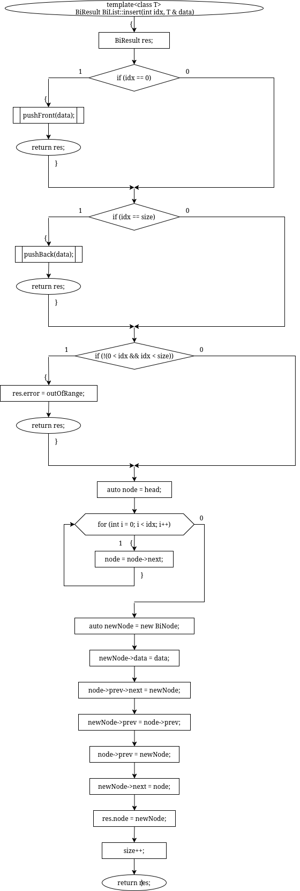
- Двунаправленный список: Main Bi: 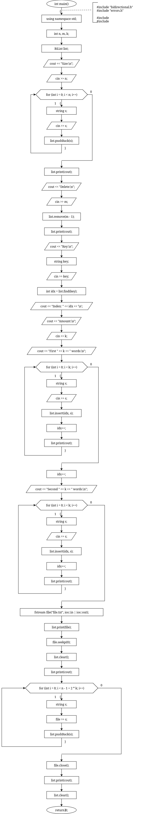
- Двунаправленный список: Pop Back: 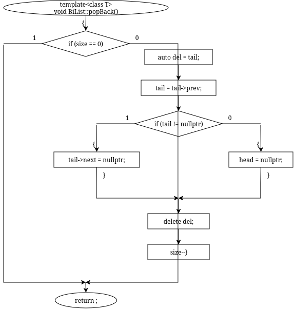
- Двунаправленный список: Pop Front: 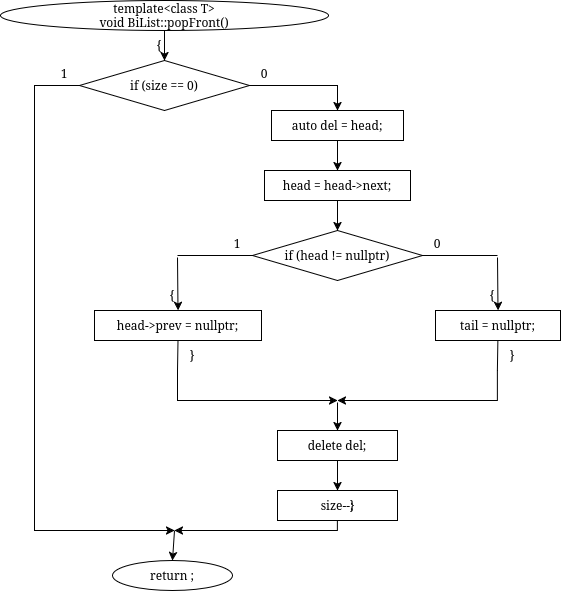
- Двунаправленный список: Print: 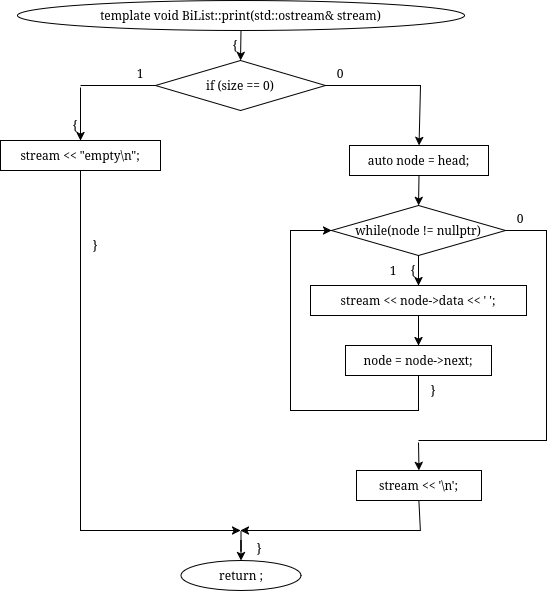
- Двунаправленный список: Push Back: 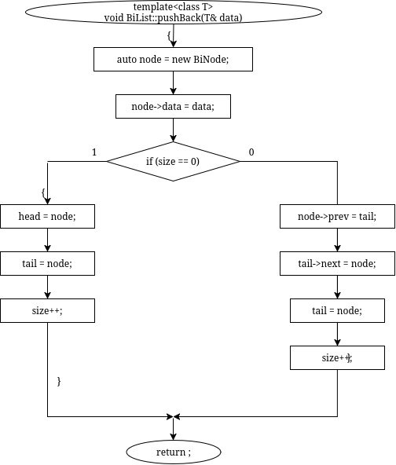
- Двунаправленный список: Push Front: 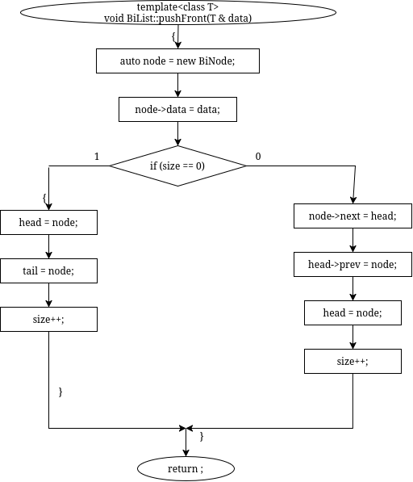
- Двунаправленный список: Remove: 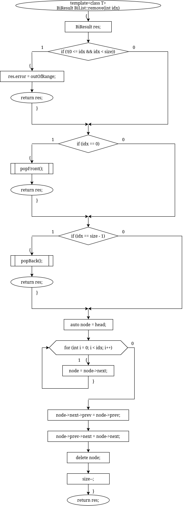
