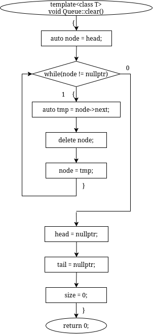
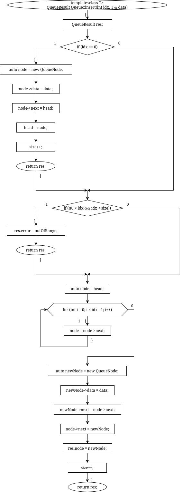
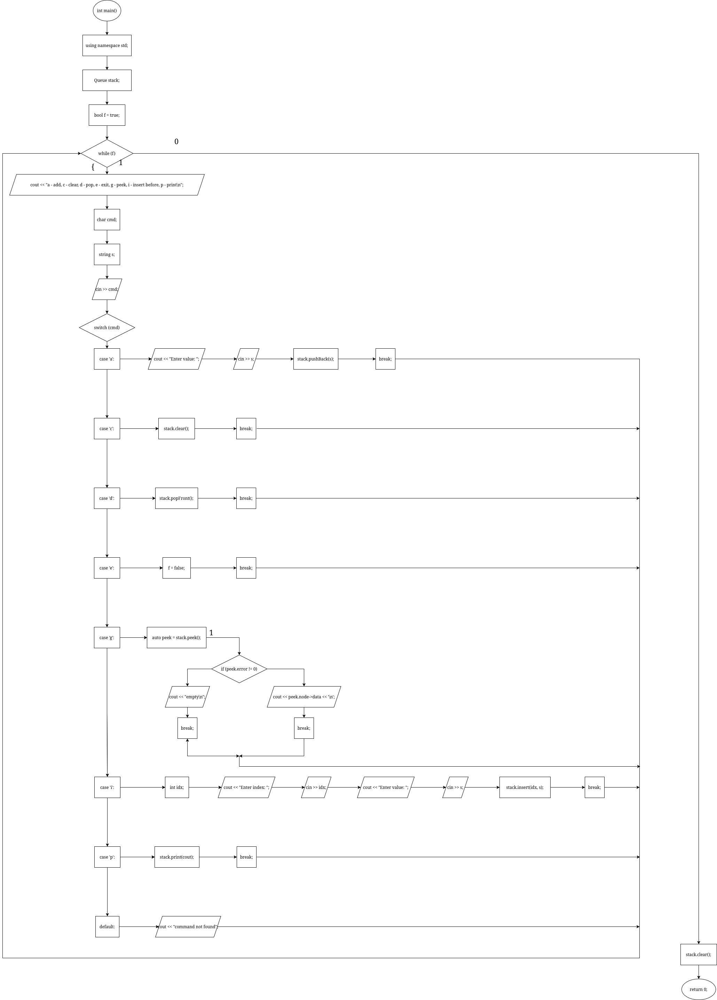
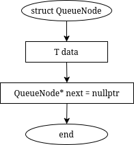
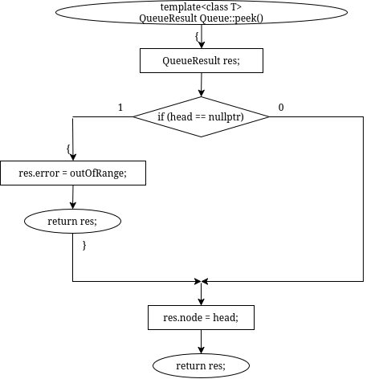
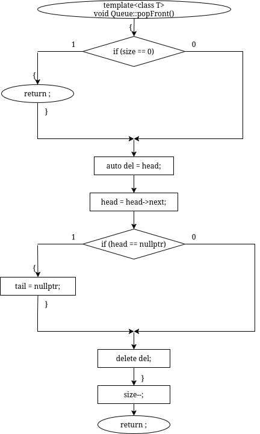
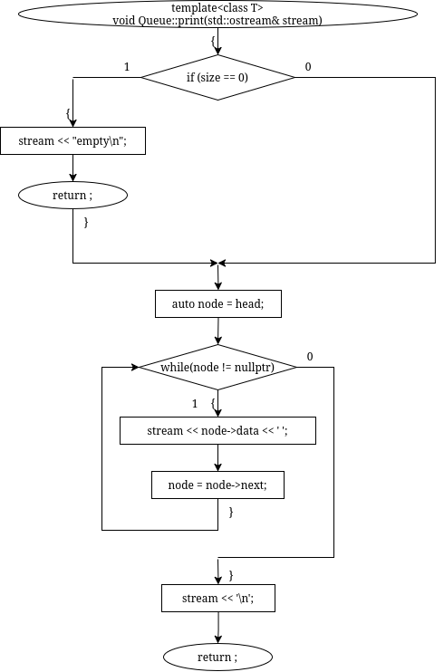
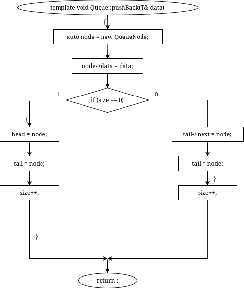
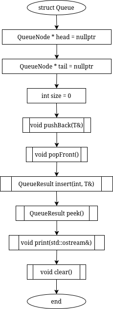
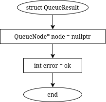

# sem2 / manual_1 / lab11 / queue

## Код
- [queue.cpp](queue.cpp)
- [queue.h](queue.h)

## Иллюстрации
- Очередь: Clear: 
- Очередь: Insert: 
- Очередь: Main: 
- Очередь: Node: 
- Очередь: Peek: 
- Очередь: Popfront: 
- Очередь: Print: 
- Очередь: Pushback: 
- Очередь: Queue: 
- Очередь: Result: 
