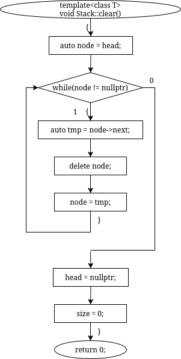
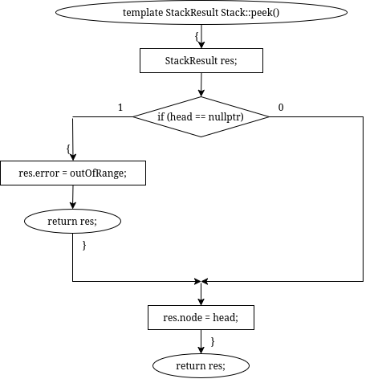
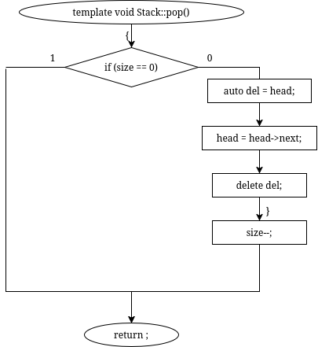
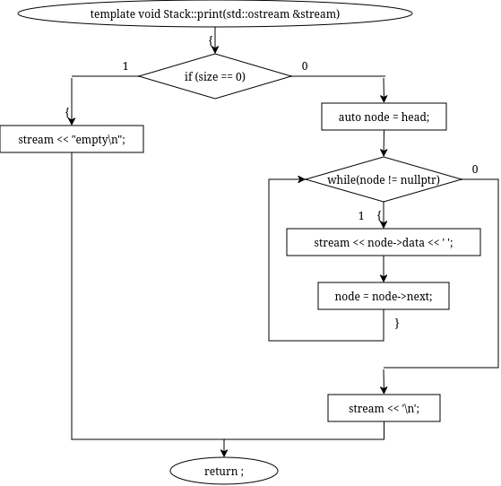
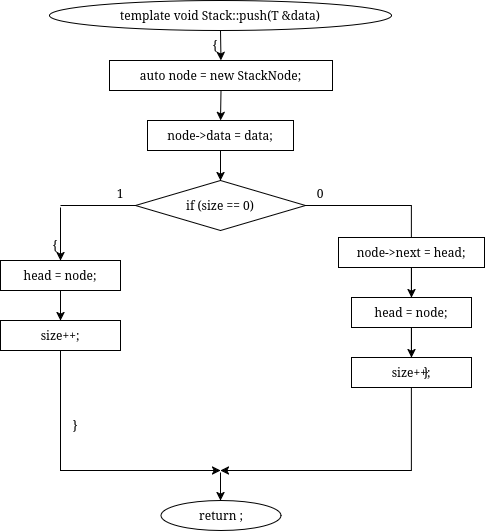
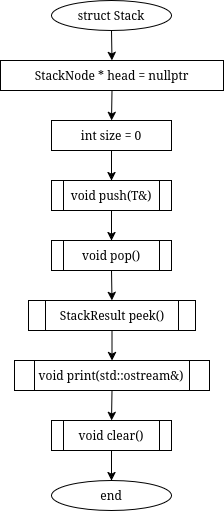
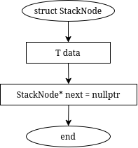
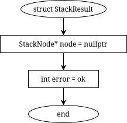

# sem2 / manual_1 / lab11 / stack

## Код
- [stack.cpp](stack.cpp)
- [stack.h](stack.h)

## Иллюстрации
- Стек: Clear: 
- Стек: Peek: 
- Стек: Pop: 
- Стек: Print: 
- Стек: Push: 
- Стек: Stack: 
- Стек: Stack Node: 
- Стек: Stack Result: 
