# sem2 / manual_1 / lab11 / unidirectional

## Код
- [unidirectional.cpp](unidirectional.cpp)
- [unidirectional.h](unidirectional.h)

## Иллюстрации
- Односвязный список: Uni List: 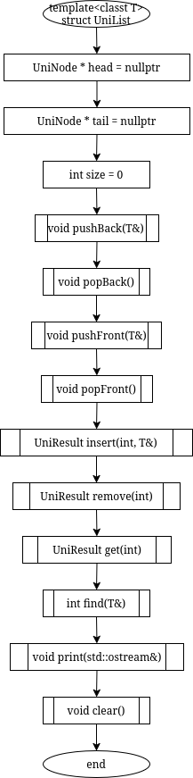
- Односвязный список: Uni Node: 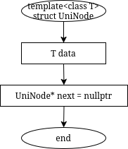
- Односвязный список: Uni Result: 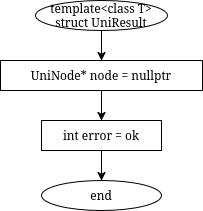
- Односвязный список: Clear: 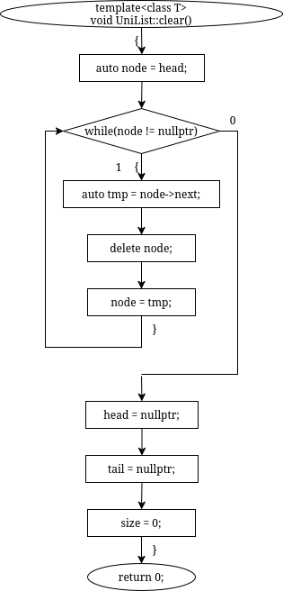
- Односвязный список: Find: 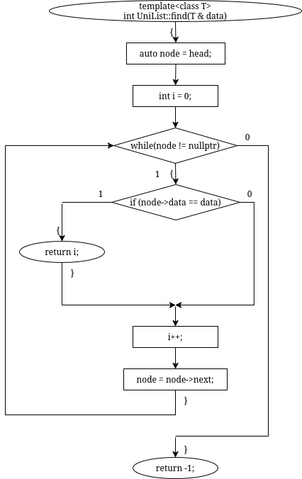
- Односвязный список: Get: 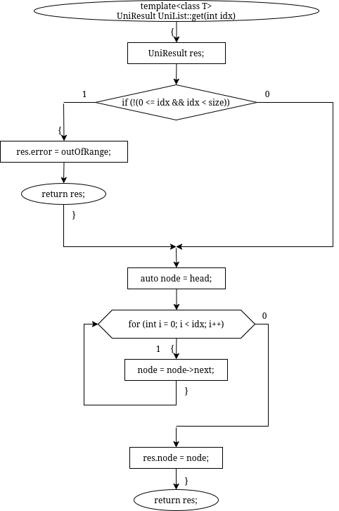
- Односвязный список: Insert: 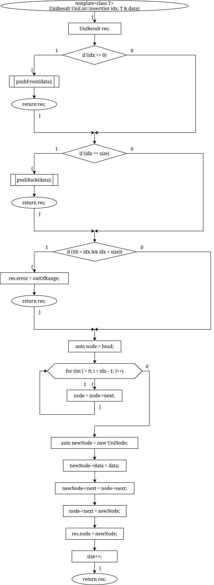
- Односвязный список: Main: 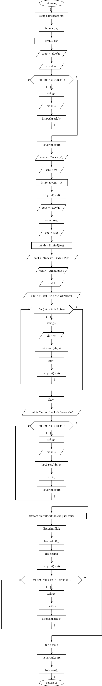
- Односвязный список: Popback: 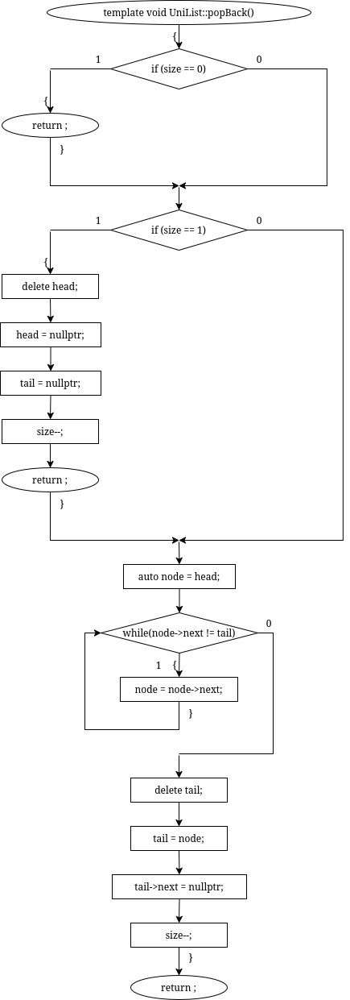
- Односвязный список: Popfront: 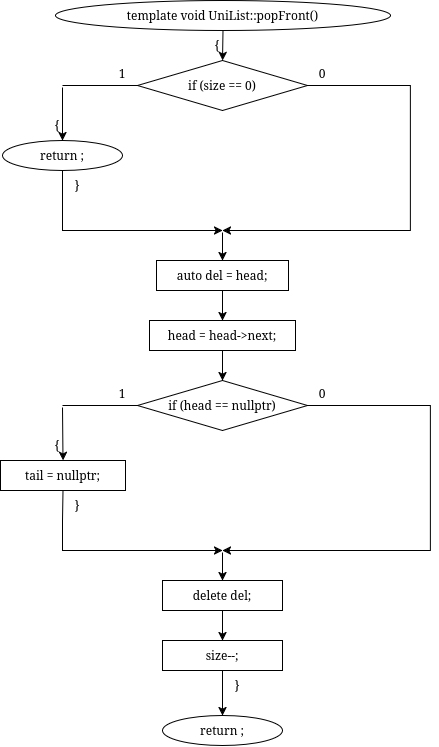
- Односвязный список: Print: 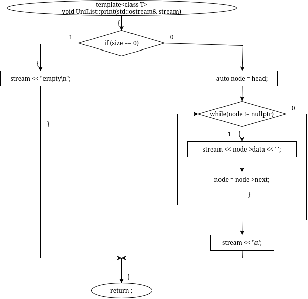
- Односвязный список: Pushback: 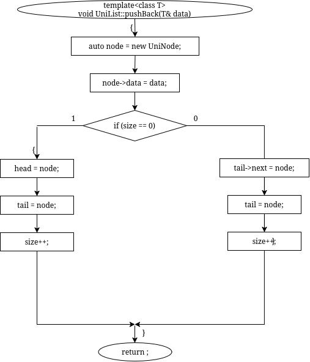
- Односвязный список: Pushfront: 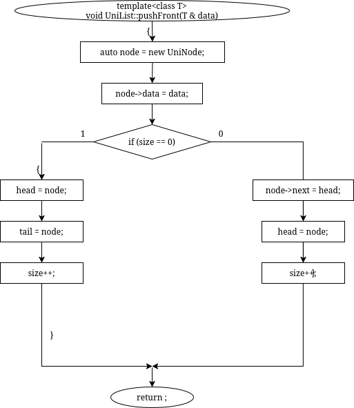
- Односвязный список: Remove: 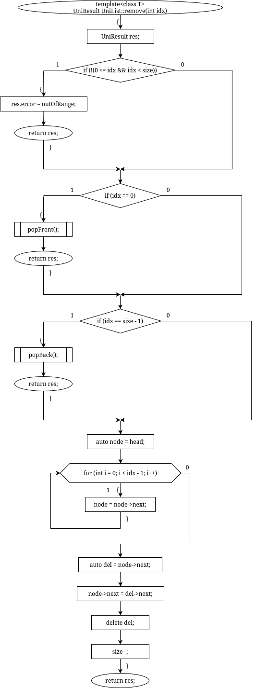
