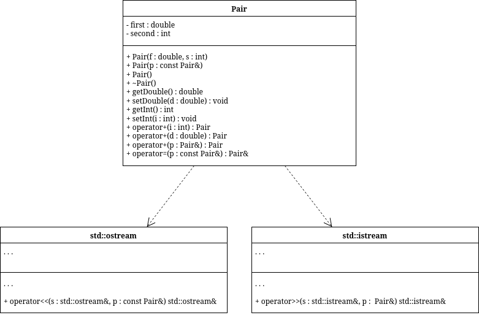

# sem2 / manual_2_oop / lab03

## Постановка задачи
1. Определить пользовательский класс.
2. Определить в классе следующие конструкторы: без параметров, с параметрами, копирования.
3. Определить в классе деструктор.
4. Определить в классе компоненты-функции для просмотра и установки полей данных (селекторы и модификаторы).
5. Перегрузить операцию присваивания.
6. Перегрузить операции ввода и вывода объектов с помощью потоков.
7. Перегрузить операции указанные в варианте.
8. Написать программу, в которой продемонстрировать создание объектов и работу всех перегруженных операций.
Создать класс Pair (пара чисел). Пара должна быть представлено двумя полями: типа int для первого числа и типа double для второго. Первое число при выводе на экран должно быть отделено от второго числа двоеточием. Реализовать:
а) вычитание пар чисел
б) добавление константы к паре (увеличивается первое число, если константа целая, второе, если константа вещественная).

## Анализ задачи
### АНАЛИЗ.

1. Согласно принципам инкапсуляции поля класса должны быть приватными, а описанные в постановке методы — публичными.
2. Для работы с приватными полями реализуем гетеры и сетеры.
3. Для объявления переменных заданного класса реализуем конструкторы: обычный (принимает на вход значения полей класса), копирования и «пустой конструктор», выставляющий значения по умолчанию.

## Вопросы и ответы
### `questions.txt`

1. Для чего используются дружественные функции и классы?
Для доступа к приватным полям вне методов класса.

2. Сформулировать правила описания и особенности дружественных функций.
- Объявляется внутри класса, не имеет доступа к this
- Может быть любой функцией или любым методом другого класса
- Может быть дружественна к нескольким классам
- Не распространяется спецификатор доступа

3. Каким образом можно перегрузить унарные операции?
- Как компонентную функцию класса
- Как глобальную функцию

4. Сколько операндов должна иметь унарная функция-операция, определяемая внутри
класса?
Ни сколько, она имеет доступ к this

5. Сколько операндов должна иметь унарная функция-операция, определяемая вне класса?
Один, так как не имеет доступа к this

6. Сколько операндов должна иметь бинарная функция-операция, определяемая внутри
класса?
Один, имеет доступ к this

7. Сколько операндов должна иметь бинарная функция-операция, определяемая вне класса?
Два, не имеет доступа к this

8. Чем отличается перегрузка префиксных и постфиксных унарных операций?
Наличием фиктивного параметра int и префиксной

9. Каким образом можно перегрузить операцию присваивания?
Pair &Pair::operator=(Pair const &p) {
    second = p.second;
    first = p.first;
    return *this;
}

10. Что должна возвращать операция присваивания?
Ссылку на класс, в котором объявлена.

11. Каким образом можно перегрузить операции ввода-вывода?
Создав friend перегрузку операторов << и >> для ostream и istream соответственно.

12. В программе описан класс
class Student
{
…
Student& operator++();
….
};
и определен объект этого класса
Student s;
Выполняется операция
++s;
Каким образом, компилятор будет воспринимать вызов функции-операции?
Префиксный инкремент, метод

13. В программе описан класс
class Student
{
…
friend Student& operator ++( Student&);
….
};
и определен объект этого класса
Student s;
Выполняется операция
++s;
Каким образом, компилятор будет воспринимать вызов функции-операции?
Префиксный инкремент, дружественная функция

14. В программе описан класс
class Student
{
…
bool operator<(Student &P);
….
};
и определены объекты этого класса
Student a,b;
Выполняется операция
cout<<a<b;
Каким образом, компилятор будет воспринимать вызов функции-операции?
Как операцию сравнения, вернёт true/false

15. В программе описан класс
class Student
{
…
friend bool operator >(const Person&, Person&)
….
};
и определены объекты этого класса
Student a,b;
Выполняется операция
cout<<a>b;
Каким образом, компилятор будет воспринимать вызов функции-операции?
Как операцию сравнения, вернёт true/false

## Результаты
Pair 1?
Double? 3.14
Int? 15
15 : 3.14
Pair 2?
Double? 2.34
Int? 8
8 : 2.34
Sum: 23 : 5.48
Integer? 10
Pair 1 + integer: 25 : 3.14
Double? 0.22
Pair 2 + double: 8 : 2.56

## Код
- [Pair.cpp](Pair.cpp)
- [Pair.h](Pair.h)
- [main.cpp](main.cpp)

## Иллюстрации
- Диаграмма: Pair: 
