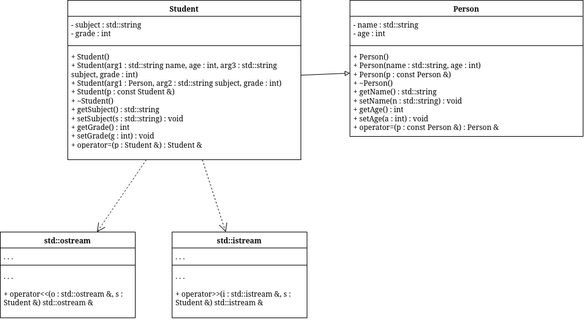

# sem2 / manual_2_oop / lab04

## Постановка задачи
1. Определить пользовательский класс.
2. Определить в классе следующие конструкторы: без параметров, с параметрами, копирования.
3. Определить в классе деструктор.
4. Определить в классе компоненты-функции для просмотра и установки полей данных (селекторы и модификаторы).
5. Перегрузить операцию присваивания.
6. Перегрузить операции ввода и вывода объектов с помощью потоков.
7. Определить производный класс.
8. Написать программу, в которой продемонстрировать создание объектов и работу всех перегруженных операций.
9. Реализовать функции, получающие и возвращающие объект базового класса.
Продемонстрировать принцип подстановки.
Базовый класс:

## Анализ задачи
### АНАЛИЗ.

1. Согласно принципам инкапсуляции поля класса должны быть приватными, а описанные в постановке методы — публичными.
2. Для работы с приватными полями реализуем гетеры и сетеры.
3. Для объявления переменных заданного класса реализуем конструкторы: обычный (принимает на вход значения полей класса), копирования и «пустой конструктор», выставляющий значения по умолчанию.

## Вопросы и ответы
### `questions.txt`

1. Для чего используется механизм наследования?
С помощью наследования может быть создана иерархия классов, которые
совместно используют код и интерфейсы.

2. Каким образом наследуются компоненты класса, описанные со спецификатором
public?
private - не доступен
public - public
protected - protected

3. Каким образом наследуются компоненты класса, описанные со спецификатором
private?
private - не доступен
public - private
protected - private

4. Каким образом наследуются компоненты класса, описанные со спецификатором
protected?
private - не доступен
public - protected
protected - protected

5. Каким образом описывается производный класс?
class Student : Person

6. Наследуются ли конструкторы?
Нет

7. Наследуются ли деструкторы?
Деструкторы не наследуются как функции, но они автоматически вызываются по цепочке наследования

8. В каком порядке конструируются объекты производных классов?
Сначала базовые, потом производные

9. В каком порядке уничтожаются объекты производных классов?
Сначала производные, потом базовые

10. Что представляют собой виртуальные функции и механизм позднего связывания?
Виртуальная функция позволяет переопределить метод базового класса в производном, чтобы затем, на этапе выполнения
программы вызывался метод не для базового класса (раннее связывание), а производного, в зависимости от реального
объекта.

11. Могут ли быть виртуальными конструкторы? Деструкторы?
Нет

12. Наследуется ли спецификатор virtual?
По определению да

13. Какое отношение устанавливает между классами открытое наследование?
Открытое (public) наследование устанавливает отношение «является» (is-a) между классами, при котором объект
производного класса может использоваться везде, где ожидается объект базового класса.

14. Какое отношение устанавливает между классами закрытое наследование?
Закрытое (private) наследование означает наследование реализации, а не типа

15. В чем заключается принцип подстановки?
Объекты производного класса должны быть взаимозаменяемы с объектами базового класса без нарушения корректности программы.

16. Имеется иерархия классов:
class Student
{
    int age;
    public:
    string name;
    ...
};
class Employee : public Student
{
    protected:
    string post;
    ...
};
class Teacher : public Employee
{
    protected: int stage;
...
};
Teacher x;
Какие компонентные данные будет иметь объект х?
Все, но без доступа к age

17. Для классов Student, Employee и Teacher написать конструкторы без параметров.
18. Для классов Student, Employee и Teacher написать конструкторы с параметрами.
19. Для классов Student, Employee и Teacher написать конструкторы копирования.
20. Для классов Student, Employee и Teacher определить операцию присваивания.

## Результаты
Alex : 20
Alex : 20 / Math : 5
John : 20 / Math : 5
Bob : 21

## Код
- [Person.cpp](Person.cpp)
- [Person.h](Person.h)
- [Student.cpp](Student.cpp)
- [Student.h](Student.h)
- [main.cpp](main.cpp)
- [question.cpp](question.cpp)

## Иллюстрации
- Диаграмма классов: 
