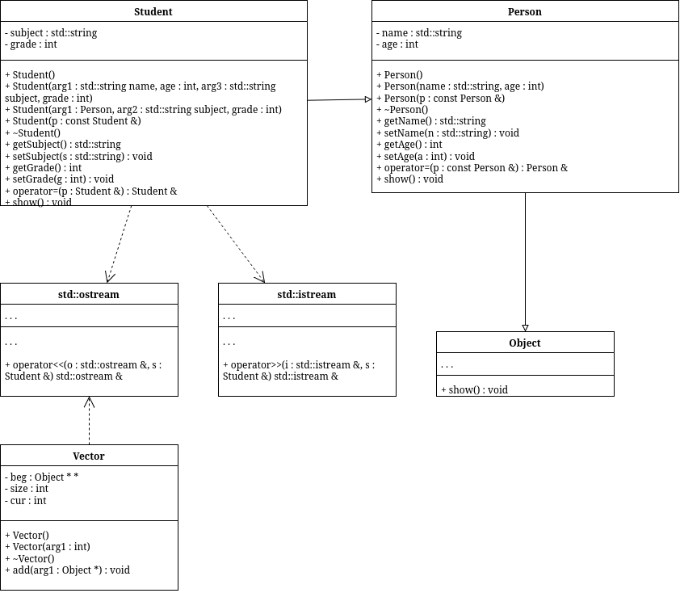

# sem2 / manual_2_oop / lab05

## Постановка задачи
Постановка задачи:
1. Определить абстрактный класс
2. Определить иерархию классов, в основе которой будет находиться абстрактный класс (иерархия классов берется из лабораторной работы №4)
3. Определить класс Вектор, элементами которого будут являться указатели на объекты иерархии классов
4. Перегрузить для класса Вектор операцию вывода объектов с помощью потоков
5. В основной функции продемонстрировать перегруженные операции и полиморфизм класса Вектор.
Базовый класс:
Базовый класс:ЧЕЛОВЕК (PERSON)Имя (name) – stringВозраст (age) – intОпределить методы изменения полей.Создать производный класс STUDENT, имеющий поля Предмет – string Оценка – int. Определить методы изменения полей и метод, выдающий сообщение о неудовлетворительной оценке.

## Анализ задачи
1. Создадим абстрактный класс Object, имеющий чистую виртуальную функцию show().
2. Создадим класс Person : Object()
3. Создадим класс Teacher : Person
4. Класс vector будет оперировать указателями на Object и методом show().

## Вопросы и ответы
### `questions.txt`

1. Какой метод называется чисто виртуальным? Чем он отличается от виртуального метода?
Метод, при объявлении не имеющий и не имеющий возможность иметь реализацию. Используется ключевое слово = 0

2. Какой класс называется абстрактным?
Класс, имеющий не переопределенные (или заданные) хотя-бы одну чистую виртуальную функцию.

3. Для чего предназначены абстрактные классы?
Для описания унифицированных интерфейсов работы для различных классов.

4. Что такое полиморфные функции?
Это возможность вызывать один и тот же интерфейс для объектов разных типов.

5. Чем полиморфизм отличается от принципа подстановки?
Это механизм языка, позволяющий работать с объектами разных типов через общий интерфейс.

6. Привести примеры иерархий с использованием абстрактных классов.
class Shape {
public:
    virtual double area() = 0;
};

class Circle : public Shape {};
class Rectangle : public Shape {};
class Triangle : public Shape {};

7. Привести примеры полиморфных функций.
void getArea(Shape* s) {
    cout << s.area();
}

8. В каких случаях используется механизм позднего связывания?
При работе с виртуальными функциями, когда тип объекта известен только во время выполнения;

## Результаты
Alex : 20
John : 20 / Math : 5
John : 20 / Math : 2 not ok :(
Alex : 20

## Код
- [Object.h](Object.h)
- [Person.cpp](Person.cpp)
- [Person.h](Person.h)
- [Student.cpp](Student.cpp)
- [Student.h](Student.h)
- [Vector.cpp](Vector.cpp)
- [Vector.h](Vector.h)
- [main.cpp](main.cpp)

## Иллюстрации
- Диаграмма классов: 
