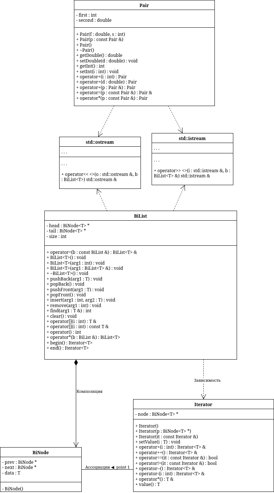

# sem2 / manual_2_oop / lab07

## Постановка задачи
1. Определить шаблон класса-контейнера (см. лабораторную работу №6).
2. Реализовать конструкторы, деструктор, операции ввода-вывода, операцию присваивания.
3. Перегрузить операции, указанные в варианте.
4. Инстанцировать шаблон для стандартных типов данных (int, float, double).
5. Написать тестирующую программу, иллюстрирующую выполнение операций для контейнера, содержащего элементы стандартных типов данных.
6. Реализовать пользовательский класс (см. лабораторную работу №3).
7. Перегрузить для пользовательского класса операции ввода-вывода.
8. Перегрузить операции необходимые для выполнения операций контейнерного класса.
9. Инстанцировать шаблон для пользовательского класса.
1
0. Написать тестирующую программу, иллюстрирующую выполнение операций для контейнера, содержащего элементы пользовательского класса.
Класс- контейнер СПИСОК с ключевыми значениями типа int.
Реализовать операции:
[] – доступа по индексу;
int() – определение размера списка;
* вектор – умножение элементов списков a[i]*b[i];
Пользовательский класс Pair (пара чисел). Пара должна быть представлено двумя полями: типа int для первого числа и типа double для второго. Первое число при выводе на экран должно быть отделено от второго числа двоеточием.

## Анализ задачи
### АНАЛИЗ.

1. Согласно принципам инкапсуляции поля классов должны быть приватными, а описанные в постановке методы — публичными.
2. Для работы с приватными полями реализуем гетеры и сетеры.
3. Для объявления переменных заданного класса реализуем конструкторы: обычный (принимает на вход значения полей класса), копирования и «пустой конструктор», выставляющий значения по умолчанию.
4. Используем темплейты для универсализации листа для всех типов данных.
5. Перегрузим оператор умножения для пары, так как лист этого требует.

## Вопросы и ответы
1. В чем смысл использования шаблонов?
Шаблоны позволяют отделить алгоритм от конкретных типов данных и создавать универсальный код, который работает с различными типами без переписывания функций или классов.

2. Каковы синтаксис/семантика шаблонов функций?
Шаблон функции задается конструкцией template <параметры_шаблона> перед определением функции. Типы данных передаются как параметры шаблона, а компилятор автоматически создает конкретную версию функции при ее вызове с определенным типом.

3. Каковы синтаксис/семантика шаблонов классов?
Шаблон класса определяется через template <параметры_шаблона> перед объявлением класса. Класс становится параметризованным и может работать с любыми типами данных, переданными в качестве параметров. Конкретный класс создается компилятором при инстанцировании.

4. Что такое параметры шаблона функции?
Это параметры, задающие типы данных, которые будут использоваться в шаблонной функции вместо конкретных типов.

5. Перечислите основные свойства параметров шаблона функции.Параметры шаблона используются как абстрактные типы, задаются в заголовке шаблона, подставляются компилятором автоматически при вызове функции и позволяют создавать разные версии функции для разных типов данных.

6. Как записывать параметр шаблона?
Параметр шаблона записывается в угловых скобках после слова template, например через ключевые слова class или typename.

7. Можно ли перегружать параметризованные функции?
Да, параметризованные функции можно перегружать.

8. Перечислите основные свойства параметризованных классов.Параметризованные классы позволяют создавать семейство классов для разных типов данных, поддерживают обобщенное программирование, могут содержать статические элементы и дружественные функции, а также могут наследоваться от обычных и шаблонных классов.

9. Все ли компонентные функции параметризованного класса являются параметризованными?
Да, компонентные функции шаблонного класса работают с параметрами шаблона этого класса.

10. Являются ли дружественные функции, описанные в параметризованном классе, параметризованными?
Нет, дружественные функции не становятся автоматически параметризованными.

11. Могут ли шаблоны классов содержать виртуальные компонентные функции?
Да, шаблоны классов могут содержать виртуальные компонентные функции, но сами шаблоны функций виртуальными быть не могут.

12. Как определяются компонентные функции параметризованных классов вне определения шаблона класса?
Перед определением функции повторно указывается заголовок шаблона, а имя функции записывается с указанием шаблонного класса и его параметров.

13. Что такое инстанцирование шаблона?
Инстанцирование — это процесс генерации компилятором конкретного класса или функции по шаблону с подстановкой определенного типа данных.

14. На каком этапе происходит генерирование определения класса по шаблону?
Генерирование происходит на этапе компиляции, когда создается экземпляр шаблона с конкретным типом.

## Результаты
Size? 3
Elements? Double? 1.1
Int? 1
Double? 2.2
Int? 2
Double? 3.3
Int? 3
Size? 2
Elements? Double? 4.4
Int? 4
Double? 5.5
Int? 5
1 : 1.12 : 2.23 : 3.3
4 : 4.45 : 5.5
l1[0] + l2[1]
6 : 6.6
Multiplication:
4 : 4.8410 : 12.1

## Код
- [Pair.cpp](Pair.cpp)
- [Pair.h](Pair.h)
- [bidirectional.cpp](bidirectional.cpp)
- [bidirectional.h](bidirectional.h)
- [main.cpp](main.cpp)

## Иллюстрации
- Диаграмма классов: 
