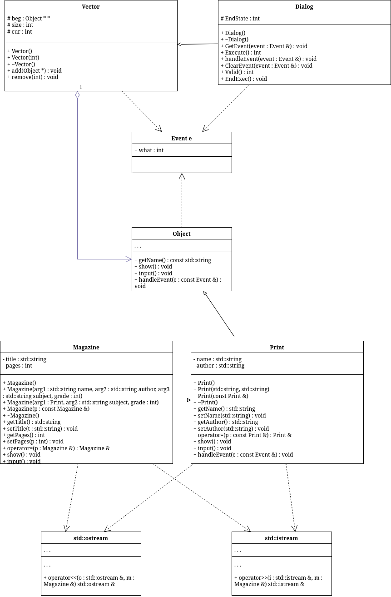

# sem2 / manual_2_oop / lab08

## Постановка задачи
1. Определить иерархию пользовательских классов (см. лабораторную работу №5). Во главе иерархии должен стоять абстрактный класс с чисто виртуальными методами для ввода и вывода информации об атрибутах объектов.
2. Реализовать конструкторы, деструктор, операцию присваивания, селекторы и модификаторы.
3. Определить класс-группу на основе структуры, указанной в варианте.
4. Для группы реализовать конструкторы, деструктор, методы для добавления и удаления элементов в группу, метод для просмотра группы, перегрузить операцию для получения информации о размере группы.
5. Определить класс Диалог – наследника группы, в котором реализовать методы для обработки событий.
6. Добавить методы для обработки событий группой и объектами пользовательских классов.
7. Написать тестирующую программу.
8. Нарисовать диаграмму классов и диаграмму объектов.
Базовый класс:
ПЕЧАТНОЕ_ИЗДАНИЕ(PRINT)Название– stringАвтор – string
Производный класс
ЖУРНАЛ (MAGAZIN)Количество страниц — intГруппа – Дерево (Tree).
Команды:
1. Создать группу: команда `m`, затем вводится размер группы.
2. Добавить элемент: команда `+`, затем выбирается тип `m` для журнала или `p` для печатного издания.
3. Удалить элемент: команда `-`, затем вводится номер элемента.
4. Вывести информацию обо всех элементах: команда `s`.
5. Вывести названия всех элементов: команда `z`.
6. Завершить работу: команда `q`.

Пример короткого запуска:

```text
m
2
+
p
Book
Author
s
q
```

## Анализ задачи
### АНАЛИЗ.

1. Внутри main() создаётся объект класса Dialog, после создания которого вызывается метод Dialog::Execute(), который переводит программу в интерактивный режим обработки пользовательских команд.
2. Метод реализует основной цикл работы программы. Цикл продолжается до тех пор, пока не будет установлен флаг завершения (EndState).
3. Внутри цикла вызывается GetEvent(), который осуществляет чтение пользовательского ввода и формирует структуру Event.
4. После формирования события оно передаётся в handleEvent(), где происходит его обработка:
5. Класс Vector реализует динамический массив указателей Object*.
6. Object является абстрактным базовым классом и определяет общий интерфейс.
7. Класс Print наследует Object и содержит поля name и author и реализует ввод/вывод данных через перегруженные операторы, а также метод show() для отображения информации.
8. Класс Magazine наследует Print и расширяет его.
9. Event представляет собой структуру обмена данными между Dialog, Vector и объектами.. Он содержит набор констант команд, соответствующих действиям пользователя и ипользуется как единый механизм передачи управляющих сигналов по системе.

## Вопросы и ответы
1. Что такое класс-группа?
Привести примеры таких классов. Класс-группа — это класс, предназначенный для хранения и управления набором объектов базового класса. Примеры: Vector (массив объектов), List (список), Tree (дерево).

2. Привести пример описания класса-группы Список (List). Класс List представляет динамическую структуру данных, содержащую указатели на объекты базового класса Object и обеспечивающую операции добавления, удаления и обхода элементов.

3. Привести пример конструктора (с параметром, без параметров, копирования) для класса-группы Список. Конструктор без параметров создаёт пустой список, с параметром задаёт начальный размер, конструктор копирования создаёт новый список как копию существующего с выделением новой памяти.

4. Привести пример деструктора для класса-группы Список. Деструктор освобождает динамически выделенную память всех элементов списка и самого массива указателей.

5. Привести пример метода для просмотра элементов для класса-группы Список. Метод просмотра проходит по всем элементам списка и вызывает у каждого объекта метод Show().

6. Какой вид иерархии дает группа?
Группа даёт композиционную иерархию объектов с общим базовым классом.

7. Почему во главе иерархии классов, содержащихся в группе объектов должен находиться абстрактный класс?
Потому что абстрактный класс задаёт общий интерфейс для всех производных классов и обеспечивает полиморфизм.

8. Что такое событие?
Для чего используются события? Событие — это структура данных, описывающая действие или команду. Используется для передачи управляющих сигналов между компонентами программы.

9. Какие характеристики должно иметь событие-сообщение?
Оно должно содержать тип события, код команды и при необходимости дополнительные параметры.

10. Привести пример структуры, описывающей событие. Структура TEvent с полями what и union, содержащим command или параметры команды.

11. Задана структура события struct TEvent { int what; union { MouseEventType mouse; KeyDownEvent keyDown; MessageEvent message; } }; Какие значения, и в каких случаях присваиваются полю what?
Поле what определяет тип события и принимает значения в зависимости от источника: мышь, клавиатура или сообщение.

12. Задана структура события struct TEvent { int what; union { int command; struct { int message; int a; }; }; }; Какие значения, и в каких случаях присваиваются полю command?
Поле command заполняется при событии-команде и содержит код выполняемой операции.

13. Для чего используются поля a и message?
Поле message содержит тип сообщения, поле a — дополнительный параметр команды.

14. Какие методы необходимы для организации обработки сообщений?
Методы GetEvent(), HandleEvent(), ClearEvent(), Valid(), EndExec().

15. Какой вид имеет главный цикл обработки событий-сообщений?
Цикл получает событие, обрабатывает его и повторяется до установки признака завершения.

16. Какую функцию выполняет метод ClearEvent()?
Каким образом? Очищает текущее событие, сбрасывая его поля в состояние отсутствия события.

17. Какую функцию выполняет метод HandleEvent()?
Каким образом? Обрабатывает событие, передавая его соответствующим объектам или выполняя команду.

18. Какую функцию выполняет метод GetEvent()?
Считывает ввод пользователя и формирует структуру события TEvent.

19. Для чего используется поле EndState?
Какой класс (объект) содержит это поле? EndState используется для завершения работы программы, содержится в классе Dialog.

20. Для чего используется функция Valid()?
Для проверки корректности текущего состояния события или объекта перед обработкой.

## Код
- [Dialog.cpp](Dialog.cpp)
- [Dialog.h](Dialog.h)
- [Event.h](Event.h)
- [Magazine.cpp](Magazine.cpp)
- [Magazine.h](Magazine.h)
- [Object.h](Object.h)
- [Print.cpp](Print.cpp)
- [Print.h](Print.h)
- [Vector.cpp](Vector.cpp)
- [Vector.h](Vector.h)
- [main.cpp](main.cpp)


## Иллюстрации
- Диаграмма классов: 
