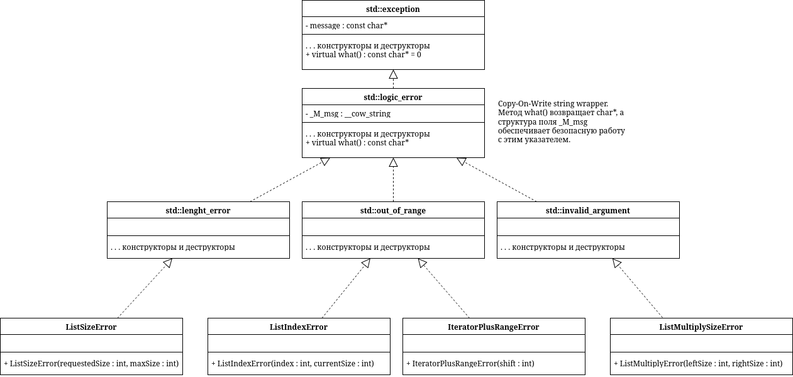
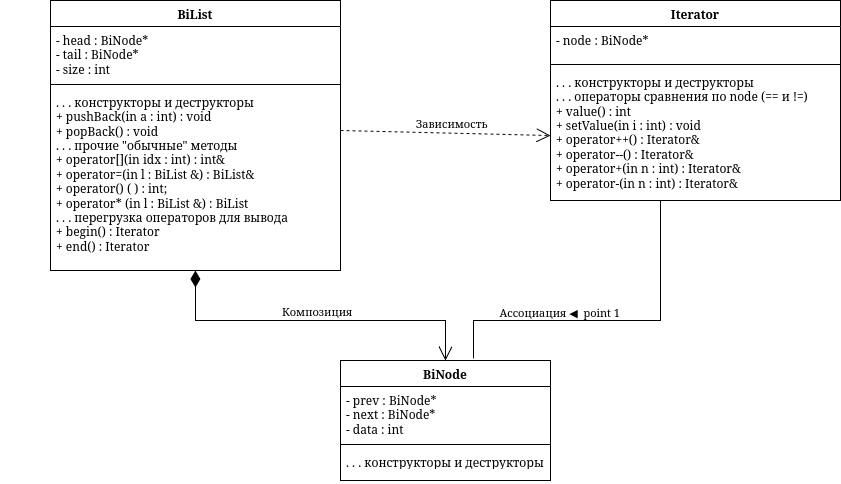

# sem2 / manual_2_oop / lab09

## Постановка задачи
1. Реализовать класс, перегрузить для него операции, указанные в варианте.
2. Определить исключительные ситуации.
3. Предусмотреть генерацию исключительных ситуаций.
Класс- контейнер СПИСОК с ключевыми значениями типа
int.
Реализовать операции:
[] – доступа по индексу;
int() – определение размера списка;
* вектор – умножение элементов списков a[i]*b[i];
+n - переход вправо к элементу с номером n.

## Анализ задачи
### АНАЛИЗ.

1. Создадим класс BiNode – узел в списке.
2. Создадим класс BiList – двунаправленный список.
3. Создадим класс Interator для перемещения по списку.
4. Создадим классы ListSizeError, ListIndexError, IteratorPlusRangeError,  ListMultiplySizeError, наследуя их от стандартных классов ошибок.

## Вопросы и ответы
### `questions.txt`

1. Что представляет собой исключение в С++?
Исключение – это непредвиденное или аварийное событие.
В С++ исключение – это объект, который система должна генерировать при возникновении исключительной ситуации. Генерация такого объекта и создает исключительную ситуацию.

2. На какие части исключения позволяют разделить вычислительный процесс? Достоинства такого подхода?
Исключения позволяют разделить вычислительный процесс на 2 части:
1) обнаружение аварийной ситуации (неизвестно как обрабатывать);
2) обработка аварийной ситуации (неизвестно, где она возникла).

Достоинства такого подхода:
1) удобно использовать в программе, которая состоит из нескольких модулей
2) не требуется возвращать значение в вызывающую функцию.

3. Какой оператор используется для генерации исключительной ситуации?
Исключение генерируется оператором throw <выражение>, где <выражение>
- либо константа,
- либо переменная некоторого типа,
- либо выражение некоторого типа.

4. Что представляет собой контролируемый блок? Для чего он нужен?
Для проверки возникновения исключения используется контролируемый блок try{}, с которым связана одна или несколько секций-ловушек catch. Все переменные, объявленные в этом блоке, являются локальными для этого блока.
Нужен для того, чтобы охватить участок кода, в котором может возникнуть исключительная ситуация, и связать его с обработчиками.

5. Что представляет собой секция-ловушка? Для чего она нужна?
Секция-ловушка — это блок catch, связанный с контролируемым блоком try{}. Форма записи секции-ловушки следующая: catch( спецификация исключения ).
Нужна для перехвата и обработки исключения. При отсутствии подходящей секции-ловушки осуществляется вызов стандартной функции завершения terminate().

6. Какие формы может иметь спецификация исключения в секции-ловушке? В каких ситуациях используются эти формы?
Спецификация исключения может иметь три формы:
1) (тип имя)
2) (тип)
3) (...)
Формы 1 и 2 обрабатывают конкретные исключения, а форма 3 перехватывает все исключения, такую ловушку надо помещать последней, тогда она будет обрабатывать все исключения, которые ещё не были обработаны.
Форма 1 означает, что объект передаётся в блок обработки, чтобы его каким-то образом там использовать, например, для вывода информации в сообщении об ошибке.
Примеры:
catch( exception e)
catch( exception &e)
catch( const exception &e)
catch( exception *e)

7. Какой стандартный класс можно использовать для создания собственной иерархии исключений?
Можно определять собственные исключения, унаследовав их от класса exception.
Наследование от стандартных классов позволит использовать метод what для вывода сообщений об ошибках.

8. Каким образом можно создать собственную иерархию исключений?
Для создания собственной иерархии исключений надо объявить свой базовый класс-исключение/

9. Если спецификация исключений имеет вид: void f1()throw(int,double); то какие исключения может порождать функция f1()?
В нынешнем стандарте C++ такой синтаксис и логика не поддерживается, но в старых стандартах функция f1() может порождать исключения типов int и double.

10. Если спецификация исключений имеет вид: void f1()throw(); то какие исключения может порождать функция f1()?
В нынешнем стандарте C++ такой синтаксис и логика не поддерживается, но в старых стандартах считается, что функция исключений не генерирует. Но работает noexept.

11. В какой части программы может генерироваться исключение?
Исключение генерируется внутри контролируемого блока try{}:

12. Функция вычисления площади треугольника по формуле Герона в 4 вариантах.
class TriangleException : public std::exception {
public:
    const char* what() const noexept override {
        return "Invalid triangle sides";
    }
};

double heronNoSpec(double a, double b, double c) {
    if (a <= 0 || b <= 0 || c <= 0 ||
        a + b <= c || a + c <= b || b + c <= a)
        throw -1;
    double s = (a + b + c) / 2.0;
    return sqrt(s * (s-a) * (s-b) * (s-c));
}

double heronNoThrow(double a, double b, double c) noexept {
    if (a <= 0 || b <= 0 || c <= 0 ||
        a + b <= c || a + c <= b || b + c <= a)
        return -1.0;
    double s = (a + b + c) / 2.0;
    return sqrt(s * (s-a) * (s-b) * (s-c));
}

double heronStdSpec(double a, double b, double c)
    throw(std::runtime_error) {
    if (a <= 0 || b <= 0 || c <= 0 ||
        a + b <= c || a + c <= b || b + c <= a)
        throw std::runtime_error("Invalid triangle sides");
    double s = (a + b + c) / 2.0;
    return sqrt(s * (s-a) * (s-b) * (s-c));
}

double heronOwnSpec(double a, double b, double c)
    throw(TriangleException) {
    if (a <= 0 || b <= 0 || c <= 0 ||
        a + b <= c || a + c <= b || b + c <= a)
        throw TriangleException();
    double s = (a + b + c) / 2.0;
    return sqrt(s * (s-a) * (s-b) * (s-c));
}

## Результаты
BiList(int): requested size 101 exceeds max_size 100
BiList::operator[]: index 3 is out of range [0 ; 3)
BiList::operator*: size mismatch (left=3, right=2)
Iterator::operator+: invalid shift 10 (shift moves iterator past end)

## Код
- [bidirectional.cpp](bidirectional.cpp)
- [bidirectional.h](bidirectional.h)
- [errors.h](errors.h)
- [main.cpp](main.cpp)

## Иллюстрации
- Диаграмма: Errors: 
- Диаграмма: Iterator: 
