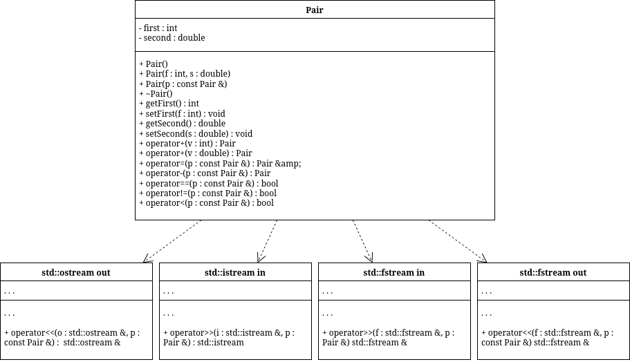

# sem2 / manual_2_oop / lab10

## Постановка задачи
1. Создать пользовательский класс с минимальной функциональностью.
2. Написать функцию для создания объектов пользовательского класса (ввод исходной информации с клавиатуры) и сохранения их в потоке (файле).
3. Написать функцию для чтения и просмотра объектов из потока.
4. Написать функцию для удаления объектов из потока в соответствии с заданием варианта. Для выполнения задания выполнить перегрузку необходимых операций.
5. Написать функцию для добавления объектов в поток в соответствии с заданием варианта. Для выполнения задания выполнить перегрузку необходимых операций.
6. Написать функцию для изменения объектов в потоке в соответствии с заданием варианта. Для выполнения задания выполнить перегрузку необходимых операций.
7. Для вызова функций в основной программе предусмотреть меню.
Создать класс Pair (пара чисел). Пара должна быть представлено двумя полями: типа int для первого числа и типа double для второго. Первое число при выводе на экран должно быть отделено от второго числа двоеточием. Реализовать:
1. вычитание пар чисел
2. добавление константы к паре (увеличивается первое число, если константа целая, второе, если константа вещественная).
Задание:
1. Удалить все записи меньшие заданного значения.
2. Увеличить все записи с заданным значением на число L.
3. Добавить K записей после элемента с заданным номером.

## Анализ задачи
### АНАЛИЗ.

1. Поля Pair приватные, доступ через методы.
2. Формат вывода: first:second.
3. Для удаления и поиска нужны операторы сравнения.
4. Файл обрабатывается через временный файл.

## Вопросы и ответы
1. Что такое поток?
Последовательность данных для ввода/вывода.

2. Какие типы потоков существуют?
Ввод, вывод и двунаправленные; файловые, стандартные, строковые.

3. Какую библиотеку надо подключить при использовании стандартных потоков?
<iostream>

4. Какую библиотеку надо подключить при использовании файловых потоков<fstream>

5. Какую библиотеку надо подключить при использовании строковых потоков<sstream>

6. Какая операция используется при выводе в форматированный потокОператор <<

7. Какая операция используется при вводе из форматированных потоков?
Оператор >>

8. Какие методы используются при выводе в форматированный поток?
write, put, flush.

9. Какие методы используются при вводе из форматированного потока?
read, get, getline, peek.

10. Какие режимы для открытия файловых потоков существуют?
ios::in, ios::out, ios::app, ios::trunc, ios::ate, ios::binary.

11. Какой режим используется для добавления записей в файл?
ios::app (обычно с ios::out).

12. Какой режим используется в ifstream file("f.txt")?
ios::in.

13. Какой режим используется в fstream file("f.txt")?
ios::in | ios::out.

14. Какой режим используется в ofstream file("f.txt")?
ios::out | ios::trunc.

15. Как открывается поток в режиме ios::out|ios::app?
Файл открывается для записи с добавлением в конец.

16. Как открывается поток в режиме ios::out|ios::trunc?
Файл очищается и открывается для записи.

17. Как открывается поток в режиме ios::out|ios::in|ios::trunc?
Файл создается/очищается и открыт на чтение/запись.

18. Как открыть файл для чтения?
ifstream file("f.txt", ios::in);

19. Как открыть файл для записи?
ofstream file("f.txt", ios::out | ios::trunc);

20. Примеры открытия файловых потоков в разных режимах.ifstream("f.txt"); ofstream("f.txt", ios::app); fstream("f.txt", ios::in|ios::out).

21. Примеры чтения объектов из потока.stream >> obj; или getline(stream, s).

22. Примеры записи объектов в поток.stream << obj; или stream.write(buf, n).

23. Алгоритм удаления записей из файла.

1. Чтение 2. запись в temp без удаляемых 3. замена файла.

24. Алгоритм добавления записей в файл.Для середины: temp, вставка по месту; для конца: ios::app.

25. Алгоритм изменения записей в файле.

1. Чтение 2. запись в temp с заменой нужных 3. заменить файл.

## Результаты
1. Make file2. Print file3. Delete records less than key4. Increase records equal to key5. Add K records after N0. Exit1file name?f1N?51 1.12 2.23 3.34 4.45 5.51. Make file2. Print file3. Delete records less than key4. Increase records equal to key5. Add K records after N0. Exit4file name?f1Key pair (int double):1 1.1Constant type (1-int, 2-double)?1L?9991. Make file2. Print file3. Delete records less than key4. Increase records equal to key5. Add K records after N0. Exit5file name?f1N?1K?36 6.67 7.78 8.81. Make file2. Print file3. Delete records less than key4. Increase records equal to key5. Add K records after N0. Exit2file name?f11000:1.16:6.67:7.78:8.82:2.23:3.34:4.45:5.51. Make file2. Print file3. Delete records less than key4. Increase records equal to key5. Add K records after N0. Exit3file name?f1Key pair (int double):3 3.31. Make file2. Print file3. Delete records less than key4. Increase records equal to key5. Add K records after N0. Exit2file name?f11000:1.16:6.67:7.78:8.83:3.34:4.45:5.51. Make file2. Print file3. Delete records less than key4. Increase records equal to key5. Add K records after N0. Exit0

## Код
- [Pair.cpp](Pair.cpp)
- [Pair.h](Pair.h)
- [file_work.h](file_work.h)
- [main.cpp](main.cpp)

## Иллюстрации
- Диаграмма классов: 
