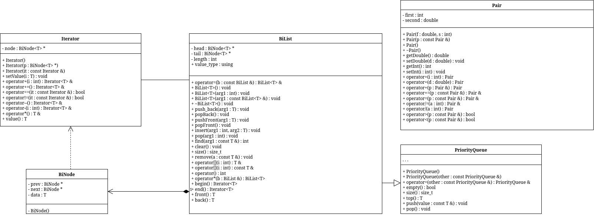

# sem2 / manual_2_oop / lab11

## Постановка задачи
Задача 1
1. Контейнер - список
2. Тип элементов - double
Задача 2
Тип элементов Pair (см. лабораторную работу №3).
Задача 3
Параметризированный класс – Список (см. лабораторную работу №7)
Задача 4
Адаптер контейнера – очередь с приоритетами.
Задача 5
Параметризированный класс – Список
Адаптер контейнера – очередь с приоритетами.
Задание 3
Найти среднее арифметическое и добавить его в конец контейнера
Задание 4
Найти элементы ключами из заданного диапазона и удалить их из контейнера
Задание 5
К каждому элементу добавить сумму минимального и максимального элементов контейнер.

## Анализ задачи
### АНАЛИЗ.

1. Для каждого задания реализуем template-функции (subtasks). Для всех задач будут использоваться они.
2. Определим необходимые методы и операторы для пользовательских классов, используемых в заданиях.
3. Создадим отдельные функции (tasks) для инициализации всех структур задач и запуска соответствующих заданий.

## Вопросы и ответы
1. Из каких частей состоит библиотека STL?
Контейнеры, итераторы

2. Какие типы контейнеров существуют в STL?
Последовательные, ассоциативные, адаптеры контейнеров

3. Что нужно сделать для использования контейнера STL в своей программе?
Подключить соответствующий заголовочный файл и указать тип элементов через шаблон

4. Что представляет собой итератор?
Итератор — более общее понятие, чем указатель, используемое для доступа к элементам контейнера

5. Какие операции можно выполнять над итераторами?
Разыменование (*), присваивание, сравнение (==, !=), инкремент (++)

6. Каким образом можно организовать цикл для перебора контейнера с использованием итератора?
for (i = first; i != last; i++)

7. Какие типы итераторов существуют?
Входные, выходные, прямые, двунаправленные, итераторы произвольного доступа

8. Перечислить операции и методы общие для всех контейнеров.==, !=, =, clear, insert, erase, size, max_size, empty, begin, end, reverse begin/end

9. Какие операции являются эффективными для контейнера vector?
Почему?Доступ по [] и at, push_back; потому что элементы в непрерывной памяти

10. Какие операции являются эффективными для контейнера list?
Почему?Вставка и удаление в любой позиции; так как это двусвязный список

11. Какие операции являются эффективными для контейнера deque?
Почему?Вставка и удаление в начале и конце; так как поддерживает работу с обоими концами

12. Перечислить методы, которые поддерживает последовательный контейнер vector.push_back, pop_back, insert, erase, [], at, swap, clear

13. Перечислить методы, которые поддерживает последовательный контейнер list.push_back, pop_back, push_front, pop_front, insert, erase, splice, swap, clear

14. Перечислить методы, которые поддерживает последовательный контейнер deque.push_back, pop_back, push_front, pop_front, insert, erase, [], at, swap, clear

15. Задан контейнер vector. Как удалить из него элементы со 2 по 5?
v.erase(v.begin() + 1, v.begin() + 5)

16. Задан контейнер vector. Как удалить из него последний элемент?
v.erase(v.end() - 1)

17. Задан контейнер list. Как удалить из него элементы со 2 по 5?
v.erase(next(v.begin(),1), next(v.begin(),5))

18. Задан контейнер list. Как удалить из него последний элемент?
v.erase(--v.end())

19. Задан контейнер deque. Как удалить из него элементы со 2 по 5?
d.erase(d.begin() + 1, d.begin() + 5)

20. Задан контейнер deque. Как удалить из него последний элемент?
d.erase(d.end() - 1)

21. Написать функцию для печати последовательного контейнера с использованием итератора.template<class T> void print(char* String, T& C) { T::iterator p = C.begin(); for(; p != C.end(); ++p) cout << *p << " "; }

22. Что представляют собой адаптеры контейнеров?
Специализированные контейнеры, реализованные на основе базовых контейнеров

23. Чем отличаются друг от друга объявления stack<int> s и stack<int, list<int> > s?
Во втором случае стек реализован на основе списка, а в первом — по умолчанию на deque

24. Перечислить методы, которые поддерживает контейнер stack.push, pop, top, empty, size

25. Перечислить методы, которые поддерживает контейнер queue.push, pop, front, back, empty, size

26. Чем отличаются друг от друга контейнеры queue и priority_queue?
priority_queue возвращает максимальный элемент, queue работает по принципу FIFO

27. Задан контейнер stack. Как удалить из него элемент с заданным номером?
Использовать дополнительный стек-буфер: последовательно извлечь элементы из исходного stack во временный stack до нужного элемента, удалить его (не помещать обратно), затем вернуть элементы обратно в исходный стек.

28. Задан контейнер queue. Как удалить из него элемент с заданным номером?
Использовать дополнительную очередь-буфер: последовательно переносить элементы из исходной queue в вспомогательную queue до нужного элемента, пропустить его, затем продолжить перенос остальных элементов обратно

29. Написать функцию для печати контейнера stack с использованием итератора.template <class T>void printStack(stack<T> s){ vector<T> buf; while (!s.empty()) { buf.push_back(s.top()); s.pop(); } for (vector<T>::iterator i = buf.begin(); i != buf.end(); i++) cout << *it << " "; cout << '\n'; for (int i = buf.size() - 1; i >= 0; i--) s.push(buf[i]);}

30. Написать функцию для печати контейнера queue с использованием итератора.template <class T>void printQueue(queue<T> q){ vector<T> buf; while (!q.empty()) { buf.push_back(q.front()); q.pop(); } for (vector<T>::iterator it = buf.begin(); it != buf.end(); ++it) cout << *it << " "; cout << '\n'; for (size_t i = 0; i < buf.size(); ++i) q.push(buf[i]);}

## Код
- [Pair.cpp](Pair.cpp)
- [Pair.h](Pair.h)
- [PriorityQueue.h](PriorityQueue.h)
- [bidirectional.hpp](bidirectional.hpp)
- [main.cpp](main.cpp)

## Иллюстрации
- Диаграмма классов: 
