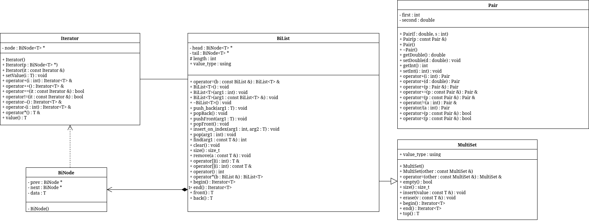

# sem2 / manual_2_oop / lab12

## Постановка задачи
Задача 1.
1. Создать ассоциативный контейнер.
2. Заполнить его элементами стандартного типа (тип указан в варианте).
3. Добавить элементы в соответствии с заданием
4. Удалить элементы в соответствии с заданием.
5. Выполнить задание варианта для полученного контейнера.
6. Выполнение всех заданий оформить в виде глобальных функций.
Задача 2.
1. Создать ассоциативный контейнер.
2. Заполнить его элементами пользовательского типа (тип указан в варианте). Для
пользовательского типа перегрузить необходимые операции.
3. Добавить элементы в соответствии с заданием
4. Удалить элементы в соответствии с заданием.
5. Выполнить задание варианта для полученного контейнера.
6. Выполнение всех заданий оформить в виде глобальных функций.
Задача 3
1. Создать параметризированный класс, используя в качестве контейнера
ассоциативный контейнер.
2. Заполнить его элементами.
3. Добавить элементы в соответствии с заданием
4. Удалить элементы в соответствии с заданием.
5. Выполнить задание варианта для полученного контейнера.
6. Выполнение всех заданий оформить в виде методов параметризированного класса.
Задание 3
Найти среднее арифметическое и добавить его в конец контейнера
Задание 4
Найти элементы ключами из заданного диапазона и удалить их из контейнера
Задание 5
К каждому элементу добавить сумму минимального и максимального элементов контейнер.

## Анализ задачи
### АНАЛИЗ.

1. Воспользуемся функциями из работы №11, изменив используемые методы соответствующие для multiset.

## Вопросы и ответы
1. Что представляет собой ассоциативный контейнер?
Ассоциативный контейнер — это структура, содержащая пары «ключ–значение», где доступ к значению осуществляется по ключу.

2. Перечислить ассоциативные контейнеры библиотеки STL.map, multimap, set, multiset

3. Каким образом можно получить доступ к элементам ассоциативного контейнера?
Через итераторы и (для map) через операцию []

4. Привести примеры методов, используемых в ассоциативных контейнерах.insert(), erase(), clear(), find(), count(), lower_bound(), upper_bound(), swap()

5. Каким образом можно создать контейнер map?
Привести примеры.map<int, float> m1;map<int, float> m2(m1);

6. Каким образом упорядочены элементы в контейнере map по умолчанию?
Как изменить порядок на обратный?По возрастанию ключа (less<Key>). Изменить можно через компаратор greater<Key>

7. Какие операции определены для контейнера map?
[], =, ==, !=, <, >, <=, >=, insert(), erase(), clear(), find()

8. Написать функцию для добавления элементов в контейнер map с помощью функции make_pair()template<class T1, class T2>void addMap(map<T1, T2>& m, int n) { for(int i = 0; i < n; i++) { T2 val; cin >> val; m.insert(make_pair(i, val)); }}

9. Написать функцию для добавления элементов в контейнер map с помощью операции []template<class T1, class T2>void addMapIndex(map<T1, T2>& m, int n) { for(int i = 0; i < n; i++) { T2 val; cin >> val; m[i] = val; }}

10. Написать функцию для печати контейнера map с помощью итератораtemplate<class T1, class T2>void printMap(map<T1, T2>& m) { for(auto i = m.begin(); i != m.end(); i++) cout << it->first << " " << it->second << '\n';}

11. Написать функцию для печати контейнера map с помощью операции []template<class T1, class T2>void printMapIndex(map<T1, T2>& m, int n) { for(int i = 0; i < n; i++) cout << i << " " << m[i] << '\n';}

12. Чем отличаются контейнеры map и multimap?
map не допускает дубликатов ключей, multimap допускает одинаковые ключи

13. Что представляет собой контейнер set?
Контейнер, хранящий уникальные отсортированные элементы без дубликатов

14. Чем отличаются контейнеры map и set?
map хранит пары ключ–значение, set хранит только ключи

15. Каким образом можно создать контейнер set?
Привести примеры.set<int> s1;set<int> s3(s2);

16. Каким образом упорядочены элементы в контейнере set по умолчанию?
Как изменить порядок на обратный?По возрастанию (less<T>), изменить на убывание можно через greater<T>

17. Какие операции определены для контейнера set?
insert(), erase(), find(), count(), clear(), begin(), end(), swap()

18. Написать функцию для добавления элементов в контейнер settemplate<class T>void addSet(set<T>& s, int n) { for(int i = 0; i < n; i++) { T val; cin >> val; s.insert(val); }}

## Результаты
task 1
-7.3 -7 -4.6 -4.3 -2.5 -0.5 -0.1 5.2 7.7 9.4
subtask 1
avg: -0.4
-7.3 -7 -4.6 -4.3 -2.5 -0.5 -0.4 -0.1 5.2 7.7 9.4
subtask 2
For delete:
-4.6 -2.5 -0.1
-7.3 -7 -4.3 -0.5 -0.4 5.2 7.7 9.4
subtask 3
(min + max) / 2 = 1.05
-6.25 -5.95 -3.25 0.55 0.65 6.25 8.75 10.45
task 2
1:0.1 2:0.1 3:0 3:0.7 6:0.3 6:0.6 7:0.6 8:0.8 9:0.4 9:0.6
subtask 1
avg: 5:0.42
1:0.1 2:0.1 3:0 3:0.7 5:0.42 6:0.3 6:0.6 7:0.6 8:0.8 9:0.4 9:0.6
subtask 2
For delete:
2:0.1 6:0.3 7:0.6 9:0.6
1:0.1 3:0 3:0.7 5:0.42 6:0.6 8:0.8 9:0.4
subtask 3
(min + max) / 2 = 5:0.25
6:0.35 8:0.25 8:0.95 10:0.67 11:0.85 13:1.05 14:0.65
task 3
7:0.1 6:0.8 6:0.6 4:0.5 3:0.8 3:0.7 2:0.8 2:0.3 1:0.8 1:0.2
subtask 1
avg: 3:0.56
7:0.1 6:0.8 6:0.6 4:0.5 3:0.8 3:0.7 3:0.56 2:0.8 2:0.3 1:0.8 1:0.2
subtask 2
For delete:
1:0.2
7:0.1 6:0.8 6:0.6 4:0.5 3:0.8 3:0.7 3:0.56 2:0.8 2:0.3 1:0.8
subtask 3
(min + max) / 2 = 4:0.45
11:0.55 10:1.25 10:1.05 8:0.95 7:1.25 7:1.15 7:1.01 6:1.25 6:0.75 5:1.25

## Код
- [MultiSet.hpp](MultiSet.hpp)
- [Pair.cpp](Pair.cpp)
- [Pair.h](Pair.h)
- [bidirectional.hpp](bidirectional.hpp)
- [main.cpp](main.cpp)

## Иллюстрации
- Диаграмма: Lab12: 
