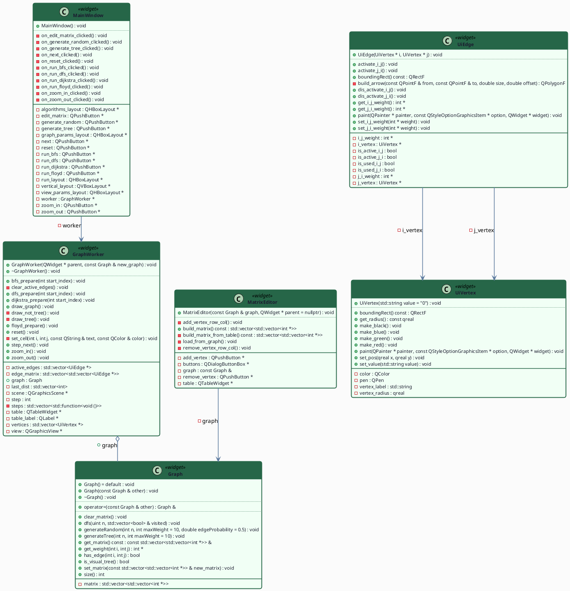

# sem2 / manual_3_grapgs / QTBNBVisualization

## Постановка задачи
Задача коммивояжера формулируется следующим образом: дан полный взвешенный граф, где вершины представляют города, а веса рёбер — расстояния (или стоимость проезда) между ними. Требуется найти гамильтонов цикл минимального веса, то есть маршрут, проходящий через каждую вершину ровно один раз и возвращающийся в исходную.Входными данными программы является матрица смежности, содержащая веса рёбер. Если ребро отсутствует, используется значение бесконечности (или достаточно большое число).
Метод ветвей и границ.Суть метода заключается в последовательном разбиении множества допустимых решений на подмножества (ветвление) и вычислении для каждого подмножества оценки снизу (границы).В данной реализации алгоритм работает по следующему принципу:Ветвление: на каждом шаге алгоритм пытается добавить в текущий путь следующую вершину.Оценка: вычисляется нижняя оценка стоимости маршрута. В данной работе используется эвристическая оценка: к текущей стоимости пройденного пути прибавляется произведение количества оставшихся вершин на минимальный вес ребра во всём графе.Отсечение: если вычисленная нижняя оценка превышает стоимость уже найденного лучшего решения (верхнюю границу), данная ветвь поиска прекращается, так как она не может привести к оптимальному решению.Рекурсия: Процесс повторяется до тех пор, пока не будет построен полный маршрут или не будут отсечены все неперспективные ветви.
Вариант 9

## Анализ задачи
### АНАЛИЗ.

Graph, UiVertex, UiEdge, MatrixEditor — см. работу “Графы”
GraphWorker — отрисовщик шагов алгоритма.
MainWindow — кнопки: Edit Matrix, Generate Random/Tree, Run BnB, Zoom In/Out, Reset, Next Step. Next Step запускает QTimer с interval=0, который вызывает сигнал step_next() пока шаги не кончатся.

## Результаты
Пример шага алгоритма
Итоговый цикл: 3→1→2→4→7→6→5→3 с ценой 96

## Код
- [Graph.cpp](Graph.cpp)
- [Graph.h](Graph.h)
- [GraphWorker.cpp](GraphWorker.cpp)
- [GraphWorker.h](GraphWorker.h)
- [MainWindow.cpp](MainWindow.cpp)
- [MainWindow.h](MainWindow.h)
- [MatrixEditor.cpp](MatrixEditor.cpp)
- [MatrixEditor.h](MatrixEditor.h)
- [UiEdge.cpp](UiEdge.cpp)
- [UiEdge.h](UiEdge.h)
- [UiVertex.cpp](UiVertex.cpp)
- [UiVertex.h](UiVertex.h)
- [main.cpp](main.cpp)

## Дополнительные материалы
- [CMakeLists.txt](CMakeLists.txt)

## Иллюстрации
- UML-диаграмма: 
